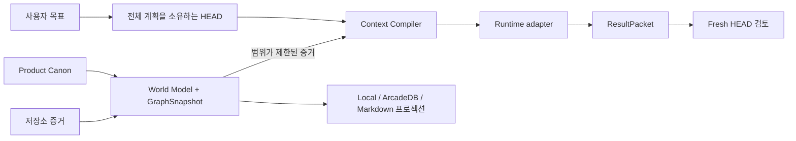

<div align="center">

# HEAD Agent Core Plugin

[English](README.md) | **한국어**

**도구와 에이전트, 대화가 바뀌어도<br>
AI 개발이 하나의 검토된 제품 방향으로 이어지게 합니다.**

대화 압축 후에도 안전하게 복구하고, 작업마다 필요한 정보만 전달하며,
승인된 변경의 이유를 함께 남깁니다.

[](https://github.com/binary1215/head-agent-plugin/actions/workflows/go-worker-build-release.yml)


[왜 사용해야 하는가](#왜-사용해야-하는가) ·
[누구에게 필요한가](#누구에게-필요한가) ·
[설치](#설치) ·
[첫 프로젝트](#첫-프로젝트) ·
[핵심 모델](#핵심-모델) ·
[그래프](#그래프와-기록) ·
[기능 현황](#기능-현황) ·
[문서](#문서)

</div>

## HEAD Agent Core가 하는 일

HEAD Agent Core는 AI와 함께 개발한 방향과 근거를 하나의 모델 대화 안에
가두지 않고 프로젝트에 보존합니다. Claude Code, Codex, OpenCode 전반에서
다음을 연결된 상태로 유지합니다.

- 사용자가 제품에 관해 승인한 내용
- 현재 저장소와 테스트에서 확인된 사실
- 이번 작업에 실제로 필요한 정보
- 에이전트가 바꾼 내용, 검증 결과, 다음 작업

HEAD의 주목적은 모델이 당장 코드를 더 잘 쓰게 만드는 것이 아닙니다. 여러
AI 작업의 결과가 시간이 지나도 하나의 검토된 제품 방향으로 축적되게 하는
것입니다. 모델 세션, Git 호스트, 생성 문서, GraphDB 어느 것도 프로젝트의
숨은 결정권자가 되지 않습니다.

## 왜 사용해야 하는가

프로젝트가 하나의 대화보다 오래 이어질수록 HEAD의 장점도 커집니다.

### 대화 압축이나 세션 손실 후에도 이어갑니다

대화 압축은 일부 내용을 잃을 수 있으며, 공급자가 만든 요약에서 중요한 조건이
빠지거나 다음 작업이 달라질 수 있습니다. 복구가 중요한 작업에서 HEAD는
정확한 목적, 승인된 결정, 현재 위치, 다음 기대 결과를 체크포인트로
보존합니다. 압축 후에는 프로젝트 방향이 달라지지 않았는지 검증한 뒤
계속합니다. 그 사이 실제 사용자의 새 요청이 들어오면 언제나 새 요청을
우선합니다.

이는 대화 내용이나 모델의 말투를 복원하는 기능이 아니라 작업 방향을 복원하는
기능입니다. 자세한 내용은 [대화 압축 복구](docs/compaction-recovery.md)와
[세션 복구](docs/session-recovery.md)를 참고하세요.

### 작업에 필요한 만큼만 컨텍스트를 전달합니다

컨텍스트는 많다고 항상 좋은 것이 아닙니다. Context Compiler는 한 에이전트가
이번 작업을 위해 무엇을 알아야 하며, 각 항목을 왜 포함해야 하는지 판단합니다.
검토된 제품 결정, 저장소 증거, 테스트, 관련 이력, 확인되지 않은 사항을 정해진
예산 안에서 선택하고, 제외한 정보와 오래된 범위도 함께 기록합니다.

그 결과인 Context Capsule은 내용으로 식별되며 재현할 수 있습니다. 검증된
입력, 컴파일러 버전, 작업과 예산이 같으면 같은 식별자가 만들어지고, 정본이나
다이제스트가 달라지면 재사용을 중단합니다. 이는 불필요한 잡음을 줄이고,
에이전트 간 인수인계를 검토하기 쉽게 만들며, 저장소 전체를 프롬프트로 넣지
않게 합니다. 자세한 내용은 [Context Compiler](docs/context-compiler.md)를
참고하세요.

### 무엇을 바꿨는지뿐 아니라 왜 바꿨는지 검토합니다

Git은 어떤 파일과 바이트가 바뀌었는지 보여줍니다. HEAD는 그 변경을 둘러싼
검토 기록도 함께 보존합니다.

```text
전체 계획
  -> 실행 범위 + 작업 컨텍스트
  -> 에이전트 결과 + 검증 증거
  -> Fresh HEAD 검토 + 명시적 결정
  -> ChangeSet + 다음 체크포인트
```

실행 결과가 스스로를 승인할 수 없으며, 중요한 다음 Run은 검토가 끝날 때까지
시작되지 않습니다. 나중에 유지보수자는 대화 기록이나 커밋 메시지를 추측하지
않고도 목표, 허용 범위, 증거, 결정, 변경된 리비전과 다음 방향을 확인할 수
있습니다. 자세한 내용은 [실행 계보](docs/execution-lineage.md)와
[ChangeSet](docs/change-sets.md)을 참고하세요.

### 제품 의도를 코드와 테스트에 연결합니다

HEAD는 검토된 Feature와 Capability가 어떤 파일, 심볼, 테스트와 관련되는지
근거가 연결된 관계 후보를 제안할 수 있습니다. 이후 정확한 변경 전후 리비전을
비교해 검토 가능한 기능 영향 후보도 만들 수 있습니다. 추론 결과는 명시적으로
검토되기 전까지 후보로 남으므로, 단순한 이름 일치가 제품 결정으로 바뀌지
않습니다. 자세한 내용은 [Feature 매핑](docs/feature-mapping.md)을 참고하세요.

### 그 밖의 장점

| 일반적인 AI 개발 문제 | HEAD가 제공하는 것 |
| --- | --- |
| 에이전트와 도구마다 프로젝트를 다르게 해석함 | Claude Code, Codex, OpenCode, HEAD와 워커가 프로젝트에 속한 동일한 `.head/` 식별자를 사용합니다. |
| 모델의 추론이 어느새 결정으로 취급됨 | 추론된 개념과 영향은 사용자가 명시적으로 승인하기 전까지 검토 가능한 후보로 남습니다. |
| 인수인계 과정에서 현재 위치가 사라짐 | 공급자에 독립적인 체크포인트가 다른 세션, 도구, 팀원을 위해 정확한 작업 방향을 보존합니다. |
| 그래프나 생성 문서가 숨은 결정권자가 됨 | GraphSnapshot, GraphDB, Markdown, 연속성 정보는 검증된 기록에서 다시 만들 수 있는 조회 결과로 남습니다. |
| 큰 저장소가 프롬프트를 압도함 | Source Scope와 제한된 컨텍스트 구성이 생성물, 외부 의존성, 복사된 자료를 일반 작업 컨텍스트에서 제외합니다. |
| 여러 에이전트 사이에서 책임이 흐려짐 | 제한된 실행, 결과 증거, 독립 검토를 구분하면서 HEAD가 하나의 전체 결과로 통합합니다. |

> 일반적인 코딩 에이전트가 현재 작업을 최적화한다면, HEAD Agent Core는
> 여러 작업이 검토된 하나의 제품 방향으로 축적되도록 최적화합니다.

이 장점들은 서로 연결됩니다.

```text
검토된 방향 + 현재 저장소 증거
  -> 최소한으로 충분한 Context Capsule
  -> 범위가 정해진 실행과 명시적 검토
  -> 결정 및 변경 이력
  -> 인수인계, 세션 손실, 대화 압축에 대비한 정확한 체크포인트
```

## 누구에게 필요한가

HEAD Agent Core는 하나의 프롬프트, 작업, 에이전트 또는 런타임을 넘어
AI와 함께 개발하는 제품의 일관성을 유지해야 하는 사람을 위한 도구입니다.

| 다음에 해당한다면 | HEAD가 제공하는 도움 |
| --- | --- |
| 여러 AI 세션에 걸쳐 제품을 만드는 1인 개발자 | 프로젝트를 처음부터 다시 설명하지 않고 검토된 방향에서 작업을 이어갑니다. |
| 여러 에이전트나 워커를 조율하는 테크 리드 | 계획, 구현, 검토를 구분하면서 결과를 하나의 전체 성과로 통합합니다. |
| 크거나 오래 유지된 저장소를 관리하는 유지보수자 | 작업마다 실제로 필요한 현재 저장소 증거와 이력만 전달합니다. |
| Claude Code, Codex, OpenCode 또는 여러 공급자를 사용하는 팀 | 대화마다 별도의 진실을 만들지 않고 공급자에 독립적인 하나의 프로젝트 상태를 유지합니다. |
| 감사 또는 안정적인 인수인계가 필요한 팀 | 승인된 변경의 목적, 증거, 명시적 결정, 영향과 복구 상태를 보존합니다. |
| 제품 의도와 구현을 연결해야 하는 제품 팀 | 검토된 Feature에서 코드, 테스트, 리비전, ChangeSet과 검토 증거까지 따라갑니다. |

한 번 끝나는 스크립트, 복구가 필요 없는 짧은 실험, 대화 기록만으로 충분한
작업에는 필요하지 않을 수 있습니다. 모델이 추론한 출력을 검토 없이 바로
승인해야 하거나, GraphDB를 프로젝트 의미의 절대적 원천으로 사용하려는
경우에도 적합하지 않습니다.

## 설치

설치 경로 중 하나를 선택하세요. Codex 및 Claude Code 마켓플레이스 경로는
대화형 Skill과 타입이 지정된 MCP 서버를 설치합니다. 사용자 범위 경로는
자동화와 복구에 사용할 전역 `head-agent` 명령도 제공합니다.

### Codex Git 마켓플레이스

```powershell
codex plugin marketplace add binary1215/head-agent-plugin --ref codex-marketplace
codex plugin add head-agent-core@head-agent-plugin
```

설치된 Skill과 MCP 서버를 불러오도록 새 Codex 작업을 시작한 뒤 다음과 같이
요청하세요.

```text
이 프로젝트의 HEAD Agent 온보딩을 초기화하거나 재개해 줘.
```

마켓플레이스 설치 자체는 프로젝트를 초기화하거나 GraphDB에 접속하거나
모델을 선택하거나 Product Canon을 승인하지 않습니다. 이러한 전이는 여전히
타입이 지정된 Core 경계를 거치며, 중요한 경우 사용자의 명시적 검토를
요구합니다.

### Claude Code Git 마켓플레이스

```powershell
claude plugin marketplace add binary1215/head-agent-plugin@claude-marketplace
claude plugin install head-agent-core@head-agent-plugin
```

설치된 Skill과 `head_core` MCP 서버를 불러오도록 새 Claude Code 세션을 시작한
뒤 다음과 같이 요청하세요.

```text
이 프로젝트의 HEAD Agent 온보딩을 초기화하거나 재개해 줘.
```

Claude Code는 플러그인을 버전별 캐시에 복사합니다. 따라서 생성된 Claude
배포판은 MCP 진입점을 `${CLAUDE_PLUGIN_ROOT}`를 통해 프로젝션하지만, 소스
Core와 `.head/` 식별자는 바꾸지 않습니다. 설치만으로 프로젝트 변경,
Product Canon 검토, GraphDB 접속 또는 모델 선택이 승인되지는 않습니다.

### Claude Code 및 OpenCode 프로젝트 프로젝션

아래 사용자 범위 설치를 사용하는 경우 프로젝트를
`--runtime claude,codex,opencode`로 초기화합니다. 마켓플레이스로 설치한 Claude
Code 사용자는 번들 Skill을 통해 같은 초기화를 요청할 수 있습니다. HEAD는
해당 프로젝트 파일이 없을 때만 Claude Code용 `CLAUDE.md`와 `.mcp.json`,
Codex용 `AGENTS.md`, OpenCode용 `opencode.json`을 만듭니다. 기존 파일은
보존하고 수동 통합용 생성 프로젝션은 `.head/generated/`에 둡니다.

초기화 후 프로젝트에서 `claude` 또는 `opencode`를 시작하세요. Claude Code는
공유 `head_core` 서버를 처음 사용할 때 프로젝트 MCP 승인을 요청합니다.
런타임별 지시·설정 파일은 프로젝션일 뿐이며, HEAD 정본은 계속 `.head/`입니다.

### 사용자 범위 CLI

요구 사항은 최신 Node.js LTS와 Git 또는 다운로드한 소스 아카이브입니다.
대상 프로젝트 내부의 Git, Go, GraphDB, 공급자 런타임은 선택 사항입니다.

Windows PowerShell:

```powershell
git clone https://github.com/binary1215/head-agent-plugin.git
Set-Location .\head-agent-plugin
.\scripts\install.ps1 --native auto --project C:\path\to\project --runtime claude,codex,opencode

head-agent --version
head-agent doctor C:\path\to\project
```

macOS 또는 Linux:

```bash
git clone https://github.com/binary1215/head-agent-plugin.git
cd head-agent-plugin
./scripts/install.sh --native auto --project /path/to/project --runtime claude,codex,opencode

head-agent --version
head-agent doctor /path/to/project
```

설치 프로그램은 내용이 검증된 릴리스를 현재 사용자의 데이터 디렉터리에
준비하고 `~/.local/bin`에 실행 파일을 만듭니다. 명시적인 `--project` 초기화
단계 전에는 셸 프로필, Codex 캐시, 원격 GraphDB 또는 기존 프로젝트를
수정하지 않습니다.

## 첫 프로젝트

### 대화 우선 경로

번들로 제공되는 `head-agent-onboarding` Skill이 권장 대화형 진입점입니다.
현재 상태를 검사하고, 저장소 범위나 저장소 모드처럼 중요한 선택만 질문하며,
증거가 연결된 후보를 제시하고, Product Canon 변경 전에 명시적인 검토를
사용합니다.

### CLI 경로

동일한 프로젝트 및 HEAD Session 식별자를 초기화하거나 재개합니다.

```powershell
head-agent init C:\path\to\project --runtime claude,codex,opencode
head-agent onboarding-status C:\path\to\project
```

처음 실행하면 일반적으로 변경 불가능한 온보딩 후보 집합 ID가 반환됩니다.
검토 전에 내용을 확인하세요.

```powershell
$onboarding = head-agent onboarding-status C:\path\to\project | ConvertFrom-Json
head-agent onboarding-candidates C:\path\to\project `
  --candidate-set $onboarding.state.candidateSetId
```

증거를 검토한 뒤에만 `onboarding-review.json`을 만드세요. 아래의 간단한
예시는 전체 부트스트랩 후보를 승인합니다. 이름 변경, 분리, 병합 또는 제외할
후보가 있다면 선택 승인이나 수정이 더 안전합니다.

```json
{
  "candidateSetId": "onboarding-candidates-<id>",
  "disposition": "accept-all",
  "rationale": "증거가 연결된 모든 후보를 검토했으며 이 부트스트랩 후보 집합을 채택합니다."
}
```

결정을 적용하고 생성된 뷰를 검증합니다.

```powershell
head-agent onboarding-review C:\path\to\project --input .\onboarding-review.json
head-agent world-status C:\path\to\project
head-agent context-preview C:\path\to\project `
  --task "검토된 Feature 하나의 구현 증거 찾기" --budget 2000
head-agent world-docs-build C:\path\to\project
head-agent resume C:\path\to\project --runtime claude,codex,opencode
```

`accept-all`은 전체 후보를 직접 확인한 경우 사용할 수 있지만 기본 권장
방식은 아닙니다. 검토에서는 의존성이 완전한 일부 후보를 승인하거나, 후보
집합을 수정·거부하거나, 추가 증거를 요청하거나, 미해결 개념을 명시적인
Unknown으로 남길 수 있습니다. 전체 계약은
[온보딩 문서](docs/onboarding.md)를 참고하세요.

### 소스 범위

생성 결과물, 벤더 의존성, 복사된 프로젝트, 대형 픽스처 또는 모델 번들이
포함된 저장소에서는 첫 인덱싱 전에 프로젝트 기준 관찰 경계를 정의하세요.

```json
{
  "mode": "existing",
  "sourceScope": {
    "includeRoots": ["src", "packages"],
    "excludeRoots": ["dist", "vendor", "generated", "fixtures"]
  }
}
```

`head-agent init ... --input .\onboarding.json`으로 전달합니다. Source Scope는
관찰 범위만 제어합니다. Product Canon을 정의하거나 후보를 승인하거나 실행
권한을 부여할 수 없습니다.

## 핵심 모델

HEAD는 의미, 복구, 증거, 뷰, 효과를 분리하여 하나의 표현이 다른 표현의
권한을 상속하지 못하게 합니다.

| 평면 | 소유 대상 | 예시 | 부여하지 않는 권한 |
| --- | --- | --- | --- |
| P1 규범적 권한 | 승인된 의미와 명시적 결정 | Product Canon, ReviewDecision | 그래프·결과·메시지에서 승인을 추론하는 권한 |
| P2 복구와 계보 | 공급자와 독립적인 프로젝트 방향 | Session, Run, 계획, Capsule, 계약, 체크포인트 | 요약이나 결과로 방향을 다시 쓰는 권한 |
| P3 증거 | 검토 가능한 관찰과 결과 | 후보, ResultPacket, ChangeSet, 영수증 | 자기 승격이나 체크포인트 작성 권한 |
| P4 파생 뷰 | 재현 가능한 검색 및 사람용 뷰 | GraphSnapshot, 탐색 결과, Markdown, 연속성 뷰 | Canon 변경이나 유일한 복구 원천이 될 권한 |
| P5 운영 효과 | 호스트 로컬 실행과 전달 | PID, 임대, 엔드포인트, 받은 편지함, 전달 영수증 | 실행·검토·승격·복구 권한 |

배포와 호스트 통합은 이 계약을 패키징하거나 실행할 뿐, 제품 의미의 여섯
번째 원천이 되지 않습니다. 전체 실행 가능 경계는
[권한 평면 문서](docs/authority-plane-contract.md)에 설명되어 있습니다.

### 아키텍처 개요



피드백 경로도 명시적입니다. 승인된 결과는 검토된 계보가 될 수 있고,
저장소를 다시 인덱싱할 수 있으며, 이후 그래프가 그 증거를 투영할 수
있습니다. 결과, 프로젝션 또는 런타임 효과가 스스로를 승인할 수는 없습니다.

### 최소 충분 컨텍스트

Context Compiler는 명시적인 예산 안에서 작업과 관련된 증거를 선택합니다.
포함·제외·오래됨·누락·잘림·미확인 항목을 기록합니다. 동일한 정본 입력,
컴파일러 버전, 탐색 정책, 예산은 동일한 Context Capsule을 재현합니다.

Capsule은 파생된 실행 입력이지 두 번째 Canon이 아닙니다. 다이제스트 또는
Canon 드리프트는 실패 폐쇄되며, 단순한 읽기·추론 작업은 기본적으로
Capsule을 만들지 않습니다.

### 실행과 복구

중요한 실행은 지속 가능하고 검토 가능한 순서를 따릅니다.

```text
WholePlanSnapshot
  → ExecutionContract + ContextCapsule
  → 런타임 또는 범위가 제한된 워커
  → ResultPacket
  → Fresh HEAD ReviewDecision
  → 승인된 계보 또는 수정된 계획
```

공급자 손실 시 대화 기록을 가져올 필요가 없습니다. `session-restore`는 정확한
P2 체크포인트와 검증된 계보에서 현재 입력을 재구성합니다. 결과가 승인된
뒤에도 `run-integrate-checkpoint`는 HEAD 또는 사용자가 복구 필드를 명시적으로
제공한 경우에만 그 검토를 새 체크포인트와 연결할 수 있습니다.

의도적인 컨텍스트 압축도 같은 경계를 사용합니다.

1. `compact-prepare`가 목적, 승인된 결정, 현재 위치, 다음 기대 결과를
   고정합니다.
2. 공급자 압축은 Core 밖에서 수행됩니다.
3. `compact-verify`가 신뢰할 수 있는 실제 사용자 턴 증거를 검사하고,
   드리프트나 요약에서 파생한 복구를 거부합니다.
4. `compact-continue`가 체크포인트에 연결된 일회용 토큰을 소비합니다.

더 새로운 실제 사용자 턴은 대기 중인 연속성보다 우선합니다. 자세한 내용은
[컨텍스트 압축 복구](docs/compaction-recovery.md)와
[Session 복구](docs/session-recovery.md)를 참고하세요.

### 제품 학습

일상적인 관찰은 지속하지 않는 메모로 남길 수 있습니다. 다른 Run, 감사,
제품 상태 전이 또는 인수인계에서 필요한 경우에만 영구 아티팩트를 만듭니다.

```text
Signal → Hypothesis → Initiative 후보 → 사용자 ReviewDecision
       → 검토된 Initiative → 승인된 실행 → OutcomeObservation
```

이 흐름은 하나의 자동 승격 사슬이 아닙니다. 증거는 증거로, 가설은 가설로
남고, 검토된 Initiative도 Product Canon과 구분됩니다.
`head-agent operating-lane-recommend`는 권한을 만들지 않으면서 가장 가벼운
안전 경로를 제안할 수 있습니다.

- Observe: 읽기와 추론 작업
- Session: 하나의 범위가 제한된 가역적 결과
- Run: 서로 의존하거나 복구 민감한 작업
- Authority: Canon, Initiative 결정, 외부 쓰기, 자격 증명 또는 복구 정본 변경

자세한 내용은 [Product Operating Loop](docs/product-operating-loop.md)를
참고하세요.

## 그래프와 기록

`GraphSnapshot`은 검증된 하나의 Repository World Model에 포함된 변경 불가능한
콘텐츠 주소 기반 증거 그래프입니다. 그래프 UI의 스크린샷, 데이터베이스
백업, 변경 가능한 최신 노드 집합이 아닙니다. 동일한 검증 입력은 동일한
`graphSnapshotId`를 생성하고, 의미가 달라지면 명시적인 계보를 가진 새
스냅샷이 생성됩니다.

`head_world_model`은 전체 모델과 현재 저장소를 빠짐없이 검증한 뒤, 전체
스냅샷 대신 크기가 제한된 상태 프로젝션을 반환합니다. 카운트, ID, digest,
표본, 생략 정보는 유지하며 더 자세한 내용은 범위가 제한된 그래프·히스토리·
런타임·시맨틱 질의 도구로 확인합니다. 따라서 freshness나 digest 계산을
생략하지 않고 MCP 응답만 작게 유지합니다.


원시 프롬프트는 이 그래프 밖에 남습니다. 제품 의미는 검토된 Canon
아티팩트를 통해서만 들어옵니다. 후보 노드는 명시적으로 검사할 수 있지만
기본 탐색과 Context 컴파일에서는 제외됩니다.

### 그래프와 기록의 경계

방향은 의도적으로 단방향입니다.

```text
P1 Product Canon + 관찰된 소스 + 검증된 P2/P3 기록
  → 복구 가능한 GraphSnapshot을 포함한 P4 Repository World Model
      → 교체 가능한 그래프 구체화: local JSON / 선택적 ArcadeDB
      → 교체 가능한 사람용 프로젝션: Markdown
```

그래프는 탐색을 소유하지만 의미나 복구 방향을 소유하지 않습니다. GraphDB나
생성된 Markdown을 삭제해도 Product Canon, Session/Run 복구, 검토 계보는
남아야 합니다. 오래되거나 변조되거나 의미적으로 달라진 프로젝션은 그래프를
재정의하지 않고 실패 폐쇄됩니다.

### 그래프 질의

```powershell
head-agent world-status C:\path\to\project
head-agent world-temporal C:\path\to\project `
  --query "<Feature, symbol, path, ChangeSet, or ReviewDecision>" `
  --depth 3 --limit 100 --edge-limit 200
head-agent context-preview C:\path\to\project --task "<task>" --budget 4000
```

탐색 결과는 스냅샷, 질의, 결과 식별자와 포함·제외·잘림 이유를 함께
반환합니다. 내장 그래프, local JSON, 활성화된 ArcadeDB 백엔드는 동일한
의미 결과를 보존해야 합니다.

## 런타임과 역할 통신

Claude Code, Codex, OpenCode는 하나의 `.head/` 권한을 공유하는 프로젝션입니다. 런타임
어댑터는 기능을 관찰하고, 정확한 권한을 최대 한 번 소비하며, 소유한 프로세스
트리를 감독하고, 구조화된 출력을 검증하고, 운영 상태를 프로젝트 밖에
보관합니다.

역할 통신 표면은 의도적으로 작습니다. 보내기, 받은 편지함 읽기, 제한된
답장 대기, 변경 불가능한 답장만 제공합니다. 신뢰된 호스트가 각 엔드포인트를
하나의 프로젝트 역할에 연결하며, 호출자가 자신의 발신자 역할을 주장할 수
없습니다. 메시지와 전달 영수증은 증거일 뿐 ReviewDecision을 생성하거나,
계약을 확장하거나, Product Canon을 변경하거나, 복구 방향을 다시 쓸 수
없습니다.

호스트별 pane, socket, CLI, UI 동작은 별도로 소유되는 선택적 어댑터에
속합니다. Core는 공급자 중립적인 엔드포인트, 프로젝트 루트, 최신 스냅샷,
증명, 승인 응답, 정리 경계를 유지합니다. 일반적인 공급자 resume과 stream은
여전히 보류되어 있습니다. 자세한 내용은
[런타임 어댑터](docs/runtime-adapters.md)와
[역할 통신](docs/role-coordination.md)을 참고하세요.

## 선택적 GraphDB

로컬 저장소가 안전한 기본값입니다. 온보딩, 컨텍스트 컴파일, 실행 계보 또는
복구에 GraphDB가 필요하지 않습니다.

ArcadeDB는 파생 그래프 프로젝션으로 명시적으로 활성화할 수 있습니다. 자격
증명은 환경 변수 참조를 통해서만 해석되며 프로젝트 아티팩트, 그래프 식별자,
생성 문서 또는 영수증에 들어가지 않습니다. 원격 활성화는 복구 가능한 내장
그래프와 의미적으로 동일함을 증명해야 합니다.

JavaScript 브리지가 의미적 기준 구현입니다. 검증된 네이티브 패키지가 있으면
읽기 전용 준비 질의가 콘텐츠 주소 기반 Go query-batch 브리지를 사용할 수
있습니다. 이 경우에도 JavaScript가 포인터, 토폴로지, 탐색 결과, 요청 연결,
영수증을 검증합니다. `HEAD_AGENT_ARCADEDB_NATIVE_MODE`는 다음 중 하나로
설정합니다.

- `auto`: 검증된 네이티브 브리지가 있으면 사용하고, 없으면 이를 알린 뒤
  JavaScript 기준 경로를 사용합니다.
- `off`: 항상 JavaScript 경로를 사용합니다.
- `required`: 검증된 네이티브 경로를 사용할 수 없으면 실패합니다.

매니페스트, 바이너리, 선택 후 다이제스트가 일치하지 않으면 항상 실패
폐쇄됩니다. 정확한 자식 프로세스에는 설정된 자격 증명 참조 변수와 제한된
OS, TLS, 로캘, 프록시 허용 목록만 전달됩니다. 계산 워커 자체는 네트워크와
권한을 갖지 않습니다. 자세한 내용은
[그래프 프로젝션 어댑터](docs/graph-projection-adapter.md)를 참고하세요.

## 설치 수명주기

### 네이티브 패키지

사용자 범위 설치와 업그레이드는 기본적으로 `--native auto`를 사용합니다.
설치 프로그램은 정확한 버전과 플랫폼 패키지를 선택하고 릴리스 체크섬,
아카이브 경로, 빌드 메타데이터, 네이티브 매니페스트를 검증한 뒤 바이너리를
릴리스 식별자에 포함합니다. JavaScript 전용 설치에는 `--native off`, 폴백을
허용할 수 없는 경우에는 `--native required`를 사용하세요.

네이티브 구성 요소는 무권한 계산, 소유 프로세스 감독, 읽기 전용 ArcadeDB
배치에 대해 서로 다른 계약을 가집니다. 어떤 구성 요소를 설치해도 Product
Canon, 그래프 식별자, 검토 권한 또는 계보는 변경되지 않습니다.

### 상태, 업그레이드, 롤백, 제거

새로 다운로드한 소스 트리에서 수명주기 명령을 실행합니다.

```powershell
node .\scripts\distribution.mjs upgrade
node .\scripts\distribution.mjs status
node .\scripts\distribution.mjs rollback
node .\scripts\distribution.mjs uninstall
```

업그레이드는 활성 포인터를 교체하기 전에 변경 불가능한 릴리스를 준비하고
검증합니다. 일반 제거는 실행 파일과 활성 포인터를 삭제하지만 복구를 위해
검증된 릴리스를 보존합니다. `uninstall --purge`는 사용자 범위 릴리스 저장소도
제거합니다. 어느 방식도 프로젝트의 `.head` 상태, Git 데이터, 생성된 프로젝트
문서 또는 GraphDB 데이터를 순회하거나 삭제하지 않습니다.

공급자 설정과 인증은 Claude Code, Codex 또는 OpenCode가 계속 소유합니다.
HEAD는 정확히 승인된 `provider/model`과 일시적인 권한·개인정보 오버레이만
전달합니다. 공급자 프리셋을 설치하거나, 자격 증명을 복사하거나,
엔드포인트를 다시 쓰지 않습니다.

## 기능 현황

상태 표시는 증거에 기반한 주장이지 로드맵 약속이 아닙니다.

- **사용 가능**: 현재 소스 배포판에 구현됨
- **실험적**: 명시적이거나 제한된 활성화 경로 뒤에 구현됨
- **계획됨**: 방향은 채택했지만 아직 배포되지 않음
- **보류됨**: 현재 마일스톤 범위에서 의도적으로 제외됨

| 영역 | 기능 | 상태 |
| --- | --- | --- |
| 프로젝트 | 초기화, Source Scope, 검토를 거치는 Product Canon | **사용 가능** |
| 지식 | World Model, 증분 갱신, Context Capsule | **사용 가능** |
| 계보 | Run, ResultPacket, Fresh HEAD 검토, Session 복구, 압축 | **사용 가능** |
| 런타임 | Claude Code, Codex, OpenCode 일회성 Session/Run 실행 | **사용 가능** |
| 런타임 증거 | 세 런타임 결정론적 fixture 및 로컬 CLI 기능 probe | **사용 가능** |
| 런타임 증거 | Claude Code 실제 모델 호출 적합성 | **실험적** |
| 워커 | 범위가 제한된 전달, 대기, 결과, 검토, 통합 | **사용 가능** |
| 역할 통신 | 지속 가능한 역할 메시징과 정확한 엔드포인트 전달 | **사용 가능** |
| 프로젝션 | 로컬 그래프와 Markdown | **사용 가능** |
| 프로젝션 | ArcadeDB | **실험적** |
| 배포 | 사용자 범위 설치, 네이티브 전달, 롤백, 안전한 제거 | **사용 가능** |
| 배포 | 검증된 Git 기반 Codex 마켓플레이스 | **사용 가능** |
| 배포 | 검증된 Git 기반 Claude Code 마켓플레이스 | **사용 가능** |
| 배포 | OpenAI 범용 플러그인 디렉터리 | **계획됨** |
| 런타임 | 일반 공급자 세션 resume과 stream | **보류됨** |
| 문서 | Obsidian 및 Notion 어댑터 | **보류됨** |

정확한 주장과 승인 증거는 이 요약에서 추론하지 말고 하위 시스템 문서와
소스 검증을 사용하세요.

## 설계 원칙

HEAD Agent Core Plugin은
[Won6314/head-agent-core](https://github.com/Won6314/head-agent-core)에서
영감을 받아 공급자 중립적인 플러그인으로 독립 재구성한 프로젝트입니다.
공식 업스트림 릴리스나 드롭인 대체재가 아닙니다. 자세한 내용은
[소스 기반 비교 문서](docs/original-head-core-comparison.md)를 참고하세요.

이 구현은 HEAD의 기반 원칙을 유지하면서 공급자 중립적인 계약으로
표현합니다.

- HEAD는 연결된 전체 결과를 소유합니다.
- 사용자는 중요한 결정 권한을 유지합니다.
- 최대 컨텍스트보다 최소 충분 컨텍스트를 우선합니다.
- 지속 가능한 Canon은 임시 모델 세션보다 오래 유지됩니다.
- 위임은 범위가 제한되며 권한을 획득하지 않습니다.
- 완료 판단에는 연결된 1차 증거가 필요합니다.
- 그래프는 의심하지 않는 권위가 아니라 검색 인덱스입니다.
- 프로젝트 의미는 런타임 메커니즘과 분리됩니다.

원래 설계 맥락은 업스트림
[Foundations](https://github.com/Won6314/head-agent-core/blob/main/packages/core/docs/FOUNDATIONS.md)와
[Technical Architecture](https://github.com/Won6314/head-agent-core/blob/main/packages/core/docs/TECHNICAL_ARCHITECTURE.md)를
참고하세요.

## 문서

다음 문서부터 살펴보세요.

- [아키텍처](docs/architecture.md): 공급자 중립적 구성
- [권한 평면](docs/authority-plane-contract.md): 실행 가능한 Graph/record 및
  권한 비증폭 계약
- [온보딩](docs/onboarding.md): 후보 추론과 명시적 검토
- [Context Compiler](docs/context-compiler.md): 재현 가능한 작업 컨텍스트
- [실행 계보](docs/execution-lineage.md): 계획, 계약, 결과, 검토, 복구
- [World Model](docs/world-model.md): 소스 증거와 그래프 구성
- [런타임 어댑터](docs/runtime-adapters.md): 기능, 호출, 프로세스 소유권
- [성능 fast path](docs/performance-fast-path-design.md): 의미 또는 권한을
  생략하지 않는 최적화

추가 참고 문서:

- [Product Model](docs/product-model.md)
- [Product Operating Loop](docs/product-operating-loop.md)
- [증분 갱신](docs/incremental-refresh.md)
- [컨텍스트 압축 복구](docs/compaction-recovery.md)
- [Session 복구](docs/session-recovery.md)
- [역할 통신](docs/role-coordination.md)
- [그래프 프로젝션 어댑터](docs/graph-projection-adapter.md)
- [문서 프로젝션 어댑터](docs/document-projection-adapter.md)
- [Codex 마켓플레이스 배포](docs/codex-marketplace.md)
- [Claude Code 마켓플레이스 배포](docs/claude-marketplace.md)

설치된 동작은 이 런타임 계약, 대상 프로젝트의 사용자 소유 Canon, 현재
Session/Run 복구 상태, 명시적인 ReviewDecision의 지배를 받습니다. 저장소
개발 이력, 벤치마크 픽스처, 유지관리자 마일스톤은 플러그인에 관한 증거이지,
이 플러그인을 사용하는 프로젝트의 지침이 아닙니다.

## 소스에서 검증

```powershell
npm test
npm run verify:newcomer
npm run verify:distribution
npm run verify:codex-marketplace
npm run verify:claude-marketplace
```

네이티브 소스는 해당 모듈 디렉터리에서 `go test ./...`와 `go vet ./...`도
지원합니다. JavaScript는 의미적 기준 구현으로 유지됩니다. 네이티브
백엔드는 픽스처 기반 적합성 검사와 무결성 검증을 통과한 뒤에만 사용 가능한
기능으로 표시됩니다.

## 상태와 라이선스

HEAD Agent Core Plugin은 알파 소프트웨어입니다. 명시적인 배포 라이선스가
선택되기 전까지 저장소는 `UNLICENSED` 상태입니다. 소스가 공개되어 있다는
사실만으로 재배포 또는 파생 사용 권한이 부여되지는 않습니다.
