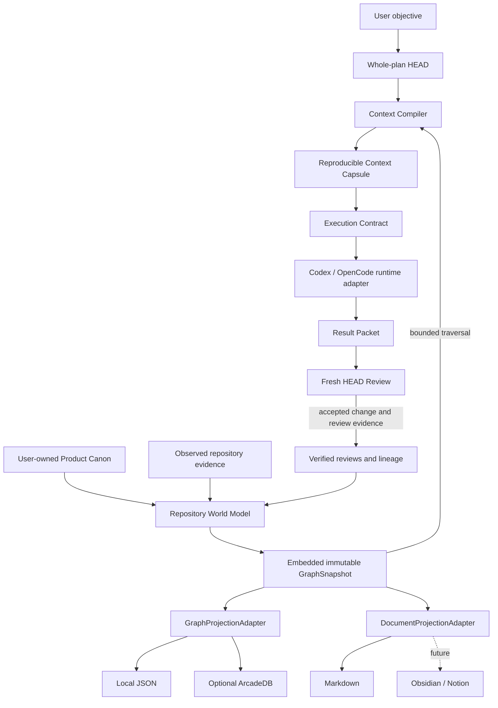

<div align="center">

# HEAD Agent Core Plugin

**Provider-neutral coordination, context compilation, and execution lineage<br>
for Codex, OpenCode, and future agent runtimes.**

[](https://github.com/binary1215/head-agent-plugin/actions/workflows/go-worker-build-release.yml)


</div>

> **Design lineage**
>
> This project takes its core design philosophy from
> [Won6314/head-agent-core](https://github.com/Won6314/head-agent-core).
> It independently adapts HEAD ownership, authority-preserving context, durable
> canon, bounded delegation, evidence-based completion, and graph-assisted
> retrieval into a provider-neutral Codex/OpenCode plugin architecture.
>
> This repository is an independent plugin-native reworking. It is not an
> official upstream release or a drop-in replacement for the original runtime.

## What is HEAD Agent Core?

HEAD Agent Core is an authority-preserving execution-lineage runtime for AI
coding agents.

It helps an agent preserve the user's objective across long-running work,
compile only the context required for the current task, execute within an
explicit boundary, and review the result without depending on one provider
conversation.

The runtime, unified graph, and projections are shown together in
[Architecture at a glance](#architecture-at-a-glance).

## Core principles

| Principle | Meaning |
| --- | --- |
| HEAD owns the whole outcome | A local executor cannot silently redefine the parent objective. |
| User authority comes first | Product, architecture, policy, cost, and external actions remain user-owned. |
| Minimum sufficient context | Context is selected for one task instead of copying an entire conversation. |
| Canon survives session loss | Project identity and accepted state live outside provider conversations. |
| Evidence is not instruction | Repository content, model output, and graph records do not automatically become authority. |
| Graph storage is replaceable | The World Model retains the recoverable GraphSnapshot; local JSON and ArcadeDB are materializations. |
| Git is optional | Git may enrich evidence but is not required for HEAD identity, lineage, or recovery. |

## Architecture at a glance

HEAD Agent Core uses one connected architecture for planning, repository
understanding, execution, review, and human-readable projection. The graph is
not a separate analytics feature: it is the evidence layer that lets each stage
refer to the same product, source, revision, decision, and execution identities.



### What is a GraphSnapshot?

A `GraphSnapshot` is the immutable, content-addressed evidence graph embedded in
one verified Repository World Model. It captures the complete graph state HEAD
can reproduce at a specific indexing, refresh, or reviewed authority-transition
boundary.

It is not a screenshot of a graph UI, a database backup, or a mutable collection
of the latest nodes. The snapshot canonically sorts and hashes its inputs,
nodes, edges, and parent identities. The same verified inputs produce the same
`graphSnapshotId`; any semantic change produces a new snapshot while prior
snapshots remain immutable.

| Question | GraphSnapshot contract |
| --- | --- |
| What is it bound to? | Exact Project, Product Model, SourceSnapshot, protocol, and parent identities. |
| What does it contain? | Product concepts, code and test entities, immutable revisions, typed relations, reviewed mappings and impacts, ChangeSets, decisions, evidence, and lineage references. |
| What does every record preserve? | Origin, evidence IDs, freshness, producer, authority class, and instruction/promotion flags. |
| When does it change? | When verified semantic inputs change through indexing, refresh, accepted review, or accepted execution evidence; no-change rebuilds retain the same identity. |
| How is history represented? | SourceSnapshots, revisions, and ChangeSets allow zero or more parents, forming DAGs without claiming automatic merge behavior. |
| Where is it stored? | Recoverably inside the World Model, then optionally materialized through local JSON or ArcadeDB and rendered into documents. |
| Is it project authority? | No. It is `derived-evidence-only`; Product Canon, observed source, and explicit review records retain their respective authority. |

### One graph, several traversal views

The unified snapshot connects product meaning to implementation and execution
without flattening their authority differences:

| View | Example question |
| --- | --- |
| Product | Which Capability and Feature express this product intent? |
| Implementation | Which reviewed File, Symbol, and Test implement or verify it? |
| Temporal | How did this Feature, source entity, or decision change? |
| Provenance | Which evidence and ReviewDecision created this relationship? |
| Execution | Which accepted Result Packet produced this ChangeSet? |
| Impact | Which reviewed product concepts does this change affect? |

Representative bounded paths include:

```text
Feature
  → reviewed IMPLEMENTS / VERIFIED_BY
  → File / Symbol / Test
  → immutable Revision
  → ChangeSet
  → execution and review evidence

ChangeSet
  → CHANGES
  → File / Symbol / Test Revision
  → reviewed IMPACTS
  → Feature / Capability
  → FeatureGroup
```

Git may attach optional VCS evidence, but it does not define ChangeSet or graph
identity. Inferred Features, mappings, impacts, and document edits stay in
explicit candidate surfaces until a scoped user review accepts them.

### Graph, database, and documents have different roles

The authority and projection direction is deliberately one-way:

```text
User-owned Product Canon + observed source + verified reviews and lineage
  → Repository World Model containing a recoverable GraphSnapshot
      → replaceable graph materialization: local JSON / optional ArcadeDB
      → replaceable human projection: Markdown / future Obsidian or Notion
```

ArcadeDB record IDs, filesystem paths, provider page IDs, and adapter names do
not enter semantic identity. A missing projection can be rebuilt from the
verified World Model; a stale, tampered, or semantically divergent projection
fails closed instead of redefining the graph.

The Context Compiler also never copies the whole graph into a model prompt. It
performs task-specific bounded traversal and records selected and excluded
evidence, stale or missing inputs, truncation, and explicit Unknowns. The same
canonical inputs, compiler version, traversal policy, and token budget reproduce
the same Context Capsule.

## Implementation status

Status terms in this README have exact meanings:

- **Available** — implemented and usable through the current source distribution.
- **Experimental** — implemented behind an explicit or limited activation path.
- **Planned** — accepted direction, but not shipped in the current alpha.
- **Deferred** — intentionally outside the current milestone.

| Capability | Status |
| --- | --- |
| Source-based CLI execution | **Available** |
| Project initialization and project-scoped HEAD Session | **Available** |
| Repository Source Scope | **Available** |
| Review-gated onboarding and Product Canon bootstrap | **Available** |
| Repository World Model and incremental refresh | **Available** |
| Context Compiler and reproducible Context Capsules | **Available** |
| Execution Lineage and Fresh HEAD review | **Available** |
| Codex Session and Run execution | **Available** |
| Go worker and native process supervision | **Available** |
| Local graph and Markdown projections | **Available** |
| ArcadeDB graph projection | **Experimental** |
| OpenCode project projection | **Available** |
| OpenCode live execution | **Planned** |
| Codex marketplace distribution | **Planned** |
| `install.ps1` and `install.sh` | **Planned** |
| Global `head-agent` command | **Planned** |
| `head-agent --version` and `head-agent doctor` | **Planned** |
| Automatic native binary installation | **Planned** |
| Atomic upgrade, rollback, and safe removal | **Planned** |
| Provider resume and durable attachment | **Deferred** |
| Obsidian and Notion projection adapters | **Deferred** |

## Installation

### Requirements

- a current Node.js LTS release;
- Git to clone this source distribution;
- Codex for the currently verified provider execution path;
- Go only when building native worker and supervisor binaries locally;
- ArcadeDB only when explicitly enabling the optional remote graph projection.

Git, Go, and GraphDB are not prerequisites for HEAD project identity, local
lineage, or recovery after the corresponding installation step is complete.

### Install and run from source — available now

The current alpha runs directly from the cloned repository.

#### Windows PowerShell

```powershell
git clone https://github.com/binary1215/head-agent-plugin.git
Set-Location .\head-agent-plugin

node .\scripts\head.mjs init C:\path\to\project --runtime codex
node .\scripts\head.mjs status C:\path\to\project
```

#### macOS or Linux

```bash
git clone https://github.com/binary1215/head-agent-plugin.git
cd head-agent-plugin

node ./scripts/head.mjs init /path/to/project --runtime codex
node ./scripts/head.mjs status /path/to/project
```

The native compute worker is optional. When a verified binary is unavailable,
supported operations use the JavaScript reference path and disclose the
fallback instead of changing semantic identity or authority.

### Simplified plugin installer — planned

The intended installation interface is shown below for roadmap clarity. These
scripts and the global command are **not included in the current alpha**.

```powershell
# Planned Windows interface — not currently runnable
git clone https://github.com/binary1215/head-agent-plugin.git
Set-Location .\head-agent-plugin
.\scripts\install.ps1
```

```bash
# Planned macOS/Linux interface — not currently runnable
git clone https://github.com/binary1215/head-agent-plugin.git
cd head-agent-plugin
./scripts/install.sh
```

The planned installer will:

1. verify Node.js, Git, and Codex;
2. configure a user-scoped Codex marketplace;
3. install `head-agent-core` through the Codex plugin interface;
4. install a cross-platform `head-agent` command wrapper;
5. install or build the matching native worker when available;
6. verify plugin and binary manifests;
7. preserve the JavaScript fallback when native compute is unavailable.

Planned lifecycle work also includes version reporting, staged diagnostics,
atomic upgrades with rollback, and removal that never deletes project `.head`
canon or lineage.

## Project onboarding

Onboarding initializes HEAD project identity, observes the repository, and
creates a reviewable product-model candidate batch. It does **not** automatically
promote inferred Features into Product Canon.

The examples below use the currently available source CLI. Replace
`C:\path\to\project` with the target project root.

### 1. Initialize the project

```powershell
node .\scripts\head.mjs init C:\path\to\project --runtime codex
```

Codex and OpenCode projections can be prepared together without claiming that
OpenCode live execution is already available:

```powershell
node .\scripts\head.mjs init C:\path\to\project --runtime codex,opencode
```

Initialization creates protected `.head/` project state, a project-scoped HEAD
Session, onboarding state, and an empty user-owned Product Model.

### 2. Select the repository source scope

For repositories containing generated output, vendored dependencies, copied
projects, model bundles, or large fixtures, record the exact project-relative
roots that should participate in product inference.

```json
{
  "includeRoots": [
    "src",
    "packages"
  ],
  "excludeRoots": [
    "dist",
    "vendor",
    "generated",
    "fixtures"
  ]
}
```

```powershell
node .\scripts\head.mjs source-scope-set C:\path\to\project --input .\source-scope.json
node .\scripts\head.mjs source-scope-status C:\path\to\project
```

Source Scope controls observation only. It cannot define Product Canon, approve
an inferred Feature, or grant execution authority.

### 3. Start onboarding

```powershell
node .\scripts\head.mjs onboarding-start C:\path\to\project
node .\scripts\head.mjs onboarding-status C:\path\to\project
```

For an existing project, HEAD indexes the selected source scope and proposes
evidence-linked FeatureGroup, Capability, and Feature candidates. A new project
can instead begin from a structured user-authored brief.

### 4. Review inferred product concepts

Inspect the immutable candidate batch before promotion:

```powershell
node .\scripts\head.mjs onboarding-candidates C:\path\to\project `
  --candidate-set onboarding-candidates-<id>
```

Apply only an explicit user-authored review:

```powershell
node .\scripts\head.mjs onboarding-review C:\path\to\project `
  --input .\onboarding-review.json
```

A review may accept a dependency-complete selection, revise the candidate set,
reject it, request additional evidence, or retain unresolved concepts as
explicit Unknowns. `accept-all` is supported by the contract but is not the
recommended default onboarding path.

See [Onboarding](docs/onboarding.md) and
[Product Model](docs/product-model.md) for the complete review contracts.

## Optional GraphDB configuration

Local JSON storage is the safe default. GraphDB is not required to initialize,
onboard, compile context, or preserve execution lineage.

ArcadeDB can be activated explicitly as a derived graph projection. Credentials
are resolved only from environment-variable references; secret values must not
be written into project artifacts, graph identities, generated documents, or
execution receipts. Remote activation must pass local/remote conformance before
it becomes current.

See [Graph projection adapter](docs/graph-projection-adapter.md) for the current
activation, recovery, and failure boundaries.

## Design lineage and acknowledgements

The foundational HEAD model used by this project comes from
[Won6314/head-agent-core](https://github.com/Won6314/head-agent-core).

This plugin adopts and independently reinterprets the following ideas:

- HEAD as the owner of the whole outcome;
- user authority above generated conclusions;
- minimum sufficient context instead of maximum context;
- durable canon outside temporary model sessions;
- bounded delegation without authority drift;
- completion based on connected evidence;
- graphs as retrieval indexes rather than unquestioned authority;
- separation of project meaning from shared runtime mechanisms.

Read the upstream
[Foundations](https://github.com/Won6314/head-agent-core/blob/main/packages/core/docs/FOUNDATIONS.md)
and
[Technical Architecture](https://github.com/Won6314/head-agent-core/blob/main/packages/core/docs/TECHNICAL_ARCHITECTURE.md)
for the original design context.

This implementation adds its own plugin-native contracts for provider-neutral
runtime adapters, deterministic Context Capsules, review-gated Product Canon,
replaceable graph and document projections, and content-derived execution
lineage.

## Documentation

- [Ultimate goal and design decisions](docs/ULTIMATE_GOAL.md)
- [Architecture](docs/architecture.md)
- [Onboarding](docs/onboarding.md)
- [Product Model](docs/product-model.md)
- [Context Compiler](docs/context-compiler.md)
- [Repository World Model](docs/world-model.md)
- [Incremental refresh](docs/incremental-refresh.md)
- [Execution Lineage](docs/execution-lineage.md)
- [Runtime adapters](docs/runtime-adapters.md)
- [Graph projection adapter](docs/graph-projection-adapter.md)
- [Document projection adapter](docs/document-projection-adapter.md)

Read [the active ultimate goal](docs/ULTIMATE_GOAL.md) before planning a
material change, starting a milestone, or declaring one complete.

## Verification from source

The repository tracks deterministic verification entry points alongside the
implementation:

```powershell
node .\scripts\verify-onboarding.mjs
node .\scripts\verify-runtime-adapters.mjs

Set-Location .\native\head-agent-worker
go test ./...
go vet ./...
```

The JavaScript implementation is the semantic reference. Native backends must
pass fixture-driven conformance before they are advertised for production use.

## Installation roadmap

The current alpha runs directly from source. Planned distribution work is:

1. add cross-platform `head-agent` command wrappers;
2. expose `head-agent --version`;
3. provide Codex marketplace packaging;
4. add `install.ps1` and `install.sh`;
5. publish versioned native worker and supervisor releases;
6. add staged `head-agent doctor` checks;
7. implement atomic upgrades with rollback;
8. implement safe removal without deleting project `.head` data.

## Project status and licensing

HEAD Agent Core Plugin is an alpha project. Capability labels above describe
the current implementation boundary and must not be read as a promise of a
specific release date.

The repository remains `UNLICENSED` until an explicit distribution license is
selected. Public source availability alone does not grant redistribution or
derivative-use rights.
