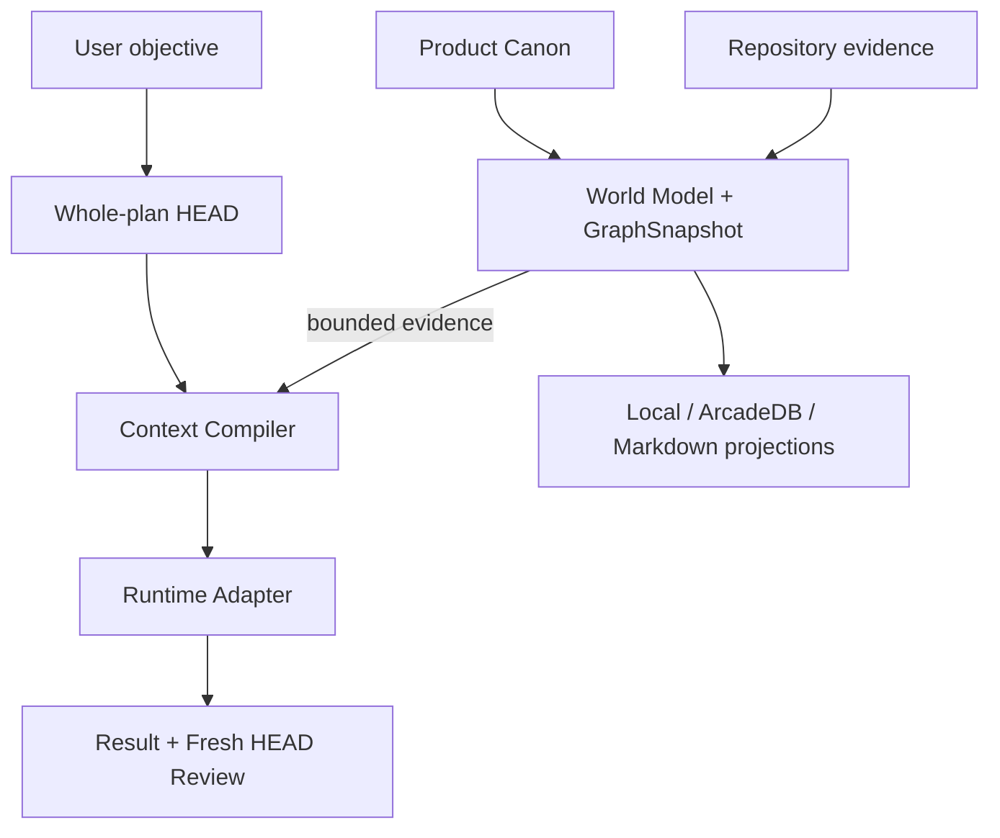
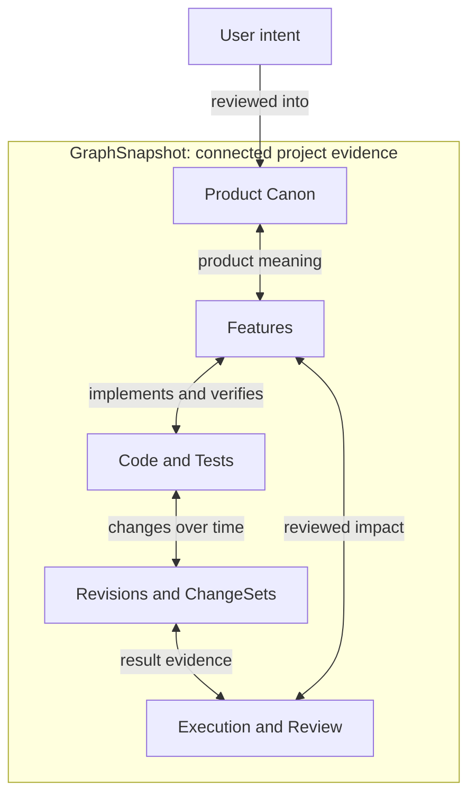

<div align="center">

# HEAD Agent Core Plugin

**Keep user intent, Product Canon, code, change history, and agent execution<br>
connected across Codex, OpenCode, and future runtimes.**

[](https://github.com/binary1215/head-agent-plugin/actions/workflows/go-worker-build-release.yml)


[Why HEAD](#why-this-architecture-is-different) ·
[Architecture](#architecture-at-a-glance) ·
[GraphSnapshot](#what-is-a-graphsnapshot) ·
[Try the graph](#try-the-graph) ·
[Installation](#installation) ·
[Status](#implementation-status)

</div>

> **Design lineage**
>
> Inspired by [Won6314/head-agent-core](https://github.com/Won6314/head-agent-core)
> and independently reworked as a provider-neutral plugin. This is not an
> official upstream release or a drop-in replacement.

## What is HEAD Agent Core?

HEAD Agent Core is a provider-neutral control plane for AI coding agents. It
turns project meaning, repository structure, change history, and execution
evidence into one reviewable system without making a chat session, Git host, or
GraphDB the hidden source of truth.

Instead of asking every new agent session to reconstruct the project from
conversation history, HEAD preserves user-owned Product Canon, builds an
immutable evidence graph, compiles task-bounded context, executes through a
runtime adapter, and requires a fresh review before a result becomes accepted
lineage.

The runtime, unified graph, and projections are shown together in
[Architecture at a glance](#architecture-at-a-glance).

## Why this architecture is different

| Common failure mode | HEAD Agent Core response |
| --- | --- |
| A provider conversation becomes project memory | Project identity, Canon, graph, and lineage survive provider-session loss. |
| A code graph cannot explain product meaning | Reviewed Feature-to-code/test relations connect intent to implementation. |
| Model inference silently becomes authority | Features, mappings, impacts, and document edits remain candidates until explicitly reviewed. |
| History depends entirely on Git | SourceSnapshot, Revision, and ChangeSet DAGs preserve lineage without requiring Git. |
| A database backend becomes the real source of truth | The World Model retains a recoverable GraphSnapshot; storage and document backends remain replaceable projections. |
| More prompt context is treated as better context | The Context Compiler selects bounded, reproducible evidence for one task. |
| Runtime support forks the core architecture | Provider-neutral HEAD Session and Run identities are executed through runtime adapters. |

## Architecture at a glance

HEAD Agent Core uses one connected architecture for planning, repository
understanding, execution, review, and human-readable projection. The graph is
not a separate analytics feature: it is the evidence layer that lets each stage
refer to the same product, source, revision, decision, and execution identities.



An accepted review is recorded as new lineage and can produce the next verified
World Model and GraphSnapshot. That feedback step is described here instead of
drawn as a loop so the primary execution path stays easy to read.

### What is a GraphSnapshot?

A `GraphSnapshot` is the immutable, content-addressed evidence graph embedded in
one verified Repository World Model. It captures the complete graph state HEAD
can reproduce at a specific indexing, refresh, or reviewed authority-transition
boundary.

It is not a screenshot of a graph UI, a database backup, or a mutable collection
of the latest nodes. The snapshot canonically sorts and hashes its inputs,
nodes, edges, and parent identities. The same verified inputs produce the same
`graphSnapshotId`; any semantic change produces a new snapshot while prior
snapshots remain immutable.

The snapshot is a connected topology, not a set of isolated catalogs. Canonical
edge directions preserve meaning, while bounded traversal can start from either
endpoint and explore the relationship in either direction.



`User intent` is shown outside the snapshot deliberately. Raw prompts do not
become graph authority. Only intent captured through reviewed Product Canon
artifacts such as Requirements, Constraints, Decisions, and Features enters the
snapshot.

<details>
<summary><strong>See how this semantic graph is encoded</strong></summary>

The picture stays intentionally semantic. The implementation preserves the
exact relationship vocabulary underneath it:

| Meaning | Graph relations |
| --- | --- |
| Product structure and governance | `CONTAINS`, `REALIZES`, `GOVERNED_BY` |
| Feature-to-implementation mapping | `IMPLEMENTS`, `VERIFIED_BY` |
| Immutable state and ancestry | `HAS_REVISION`, `CURRENT_REVISION`, `PARENT_OF` |
| Change and product impact | `CHANGES`, `SUPERSEDES`, `IMPACTS` |
| Evidence and review | `SUPPORTED_BY`, `REVIEWED_BY`, `PRODUCES`, `PROMOTED_FROM` |

| Question | GraphSnapshot contract |
| --- | --- |
| What is it bound to? | Exact Project, Product Model, SourceSnapshot, protocol, and parent identities. |
| What does it contain? | Product concepts, code and test entities, immutable revisions, typed relations, reviewed mappings and impacts, ChangeSets, decisions, evidence, and lineage references. |
| What does every record preserve? | Origin, evidence IDs, freshness, producer, authority class, and instruction/promotion flags. |
| When does it change? | When verified semantic inputs change through indexing, refresh, accepted review, or accepted execution evidence; no-change rebuilds retain the same identity. |
| How is history represented? | SourceSnapshots, revisions, and ChangeSets allow zero or more parents, forming DAGs without claiming automatic merge behavior. |
| Where is it stored? | Recoverably inside the World Model, then optionally materialized through local JSON or ArcadeDB and rendered into documents. |
| Is it project authority? | No. It is `derived-evidence-only`; Product Canon, observed source, and explicit review records retain their respective authority. |

</details>

### Traverse from any anchor

The graph preserves canonical edge direction in storage and results, but a
bounded neighborhood traversal can follow incident relationships from either
endpoint. Product, implementation, history, and provenance therefore remain
different views of the same verified snapshot.

| Start from | Traverse through | Discover |
| --- | --- | --- |
| Requirement or Decision | Feature → reviewed mapping | Implementing code, tests, revisions, and change history. |
| Feature | Canon relations or reviewed mappings | Originating intent, parent Capability, code, tests, and reviewed impacts. |
| File or Symbol | Revision and reviewed mapping | Related Features, ChangeSets, tests, and review evidence. |
| ChangeSet | Changed revisions and reviewed impacts | Exact code changes, affected Features, and Product Canon context. |
| ReviewDecision | Candidate, Evidence, and produced receipt | Why a Feature, mapping, impact, or Canon revision was accepted or rejected. |

```text
Reviewed intent → Canon → Feature → Code / Test → Revision → ChangeSet
ChangeSet → Revision → Code → Feature → Canon → reviewed intent
Code → Feature → reviewed impact → ChangeSet → Result Packet / ReviewDecision
```

Git may attach optional VCS evidence, but it does not define ChangeSet or graph
identity. Inferred Features, mappings, impacts, and document edits stay in
explicit candidate surfaces until a scoped user review accepts them.

### Try the graph

After project initialization and onboarding, the source CLI exposes the same
graph through bounded, digest-verified queries. These commands are available in
the current alpha:

```text
# Verify that the indexed World Model and GraphSnapshot are current
node scripts/head.mjs world-status <project>

# Start from a Feature, symbol, file path, ChangeSet, or ReviewDecision
node scripts/head.mjs world-temporal <project> --query "<anchor>" --depth 3 --limit 100 --edge-limit 200

# Preview the exact bounded evidence an agent would receive for one task
node scripts/head.mjs context-preview <project> --task "<task>" --budget 4000

# Render the verified graph as a human-readable Markdown projection
node scripts/head.mjs world-docs-build <project>
```

`world-temporal` returns the snapshot, query, and result identities together
with inclusion, exclusion, and truncation reasons. The same semantic result is
required whether traversal uses the embedded graph, local JSON, or an activated
ArcadeDB projection.

### Graph, database, and documents have different roles

The authority and projection direction is deliberately one-way:

```text
User-owned Product Canon + observed source + verified reviews and lineage
  → Repository World Model containing a recoverable GraphSnapshot
      → replaceable graph materialization: local JSON / optional ArcadeDB
      → replaceable human projection: Markdown / future Obsidian or Notion
```

ArcadeDB record IDs, filesystem paths, provider page IDs, and adapter names do
not enter semantic identity. A missing projection can be rebuilt from the
verified World Model; a stale, tampered, or semantically divergent projection
fails closed instead of redefining the graph.

The Context Compiler also never copies the whole graph into a model prompt. It
performs task-specific bounded traversal and records selected and excluded
evidence, stale or missing inputs, truncation, and explicit Unknowns. The same
canonical inputs, compiler version, traversal policy, and token budget reproduce
the same Context Capsule.

## Implementation status

Status terms in this README have exact meanings:

- **Available** — implemented and usable through the current source distribution.
- **Experimental** — implemented behind an explicit or limited activation path.
- **Planned** — accepted direction, but not shipped in the current alpha.
- **Deferred** — intentionally outside the current milestone.

| Capability | Status |
| --- | --- |
| Source-based CLI execution | **Available** |
| Project initialization and project-scoped HEAD Session | **Available** |
| Repository Source Scope | **Available** |
| Review-gated onboarding and Product Canon bootstrap | **Available** |
| Repository World Model and incremental refresh | **Available** |
| Context Compiler and reproducible Context Capsules | **Available** |
| Execution Lineage and Fresh HEAD review | **Available** |
| Codex Session and Run execution | **Available** |
| Go worker and native process supervision | **Available** |
| Local graph and Markdown projections | **Available** |
| ArcadeDB graph projection | **Experimental** |
| OpenCode project projection | **Available** |
| OpenCode one-shot Session and Run execution | **Experimental** |
| Codex marketplace distribution | **Planned** |
| `install.ps1` and `install.sh` | **Available** |
| User-scoped global `head-agent` command | **Available** |
| `head-agent --version` and project `head-agent doctor` | **Available** |
| Automatic native binary installation | **Planned** |
| Recoverable upgrade, verified rollback, and safe removal | **Available** |
| Provider resume and durable attachment | **Deferred** |
| Obsidian and Notion projection adapters | **Deferred** |

## Installation

### Requirements

- a current Node.js LTS release;
- Git or a downloaded source archive for the initial source distribution;
- Codex or OpenCode only when using the corresponding live execution adapter;
- Go only when building native worker and supervisor binaries locally;
- ArcadeDB only when explicitly enabling the optional remote graph projection.

Git, Go, GraphDB, and a provider runtime are not prerequisites for HEAD project
identity, local lineage, installation rollback, or local recovery. The
JavaScript reference path remains available when native compute is absent.

### User-scoped installation — available now

The installer copies a verified, content-identified release into the current
user's data directory and writes `head-agent` launchers to `~/.local/bin`. It
does not edit a Codex cache, shell profile, project `.head` directory, or remote
GraphDB. Add `~/.local/bin` to `PATH` once if the installer reports
`pathConfigured: false`.

#### Windows PowerShell

```powershell
git clone https://github.com/binary1215/head-agent-plugin.git
Set-Location .\head-agent-plugin
.\scripts\install.ps1

head-agent --version
head-agent init C:\path\to\project --runtime codex,opencode
head-agent doctor C:\path\to\project
```

#### macOS or Linux

```bash
git clone https://github.com/binary1215/head-agent-plugin.git
cd head-agent-plugin
./scripts/install.sh

head-agent --version
head-agent init /path/to/project --runtime codex,opencode
head-agent doctor /path/to/project
```

Installation defaults can be overridden without changing product canon:

```powershell
.\scripts\install.ps1 --install-root C:\user-data\head-agent --bin-dir C:\user-bin
```

```bash
./scripts/install.sh --install-root "$HOME/.head-agent" --bin-dir "$HOME/bin"
```

These locations are operational configuration only. They never participate in
project, graph, Context Capsule, or execution-lineage semantic identity.

### Upgrade, status, rollback, and removal

Run lifecycle commands from the newly downloaded source tree. `install` and
`upgrade` stage and verify an immutable release before replacing the active
pointer. If staging or verification fails, the previous pointer remains active.

```powershell
node .\scripts\distribution.mjs upgrade
node .\scripts\distribution.mjs status
node .\scripts\distribution.mjs rollback
node .\scripts\distribution.mjs uninstall
```

```bash
node ./scripts/distribution.mjs upgrade
node ./scripts/distribution.mjs status
node ./scripts/distribution.mjs rollback
node ./scripts/distribution.mjs uninstall
```

Normal removal deletes the active pointer and launchers but preserves immutable
release files so recovery remains possible. `uninstall --purge` also removes
the user-scoped release store. Neither form traverses or deletes any project's
`.head` canon, lineage, document projection, Git repository, or GraphDB data.

The source tree remains directly runnable when a global installation is not
desired:

```powershell
node .\scripts\head.mjs init C:\path\to\project --runtime codex
```

The native compute worker is optional. When a verified binary is unavailable,
supported operations use the JavaScript reference path and disclose the
fallback instead of changing semantic identity or authority. Automatic native
artifact selection/download and Codex marketplace publication remain planned;
the installer does not claim either capability today.

The current installer:

1. validates matching plugin/package versions and rejects symlinked input;
2. hashes every included file into one content-derived release identity;
3. stages, verifies, and activates the release without in-place source edits;
4. installs PowerShell/cmd and POSIX-compatible command launchers;
5. keeps prior verified releases available for explicit rollback;
6. preserves the JavaScript fallback when native compute is unavailable.

Verify the full isolated lifecycle without touching the real user installation:

```powershell
npm run verify:distribution
```

## Project onboarding

Onboarding initializes HEAD project identity, observes the repository, and
creates a reviewable product-model candidate batch. It does **not** automatically
promote inferred Features into Product Canon.

The examples below use the currently available source CLI. Replace
`C:\path\to\project` with the target project root.

### 1. Initialize the project

```powershell
node .\scripts\head.mjs init C:\path\to\project --runtime codex
```

Codex and OpenCode projections can be prepared together without claiming that
OpenCode live execution is already available:

```powershell
node .\scripts\head.mjs init C:\path\to\project --runtime codex,opencode
```

Initialization creates protected `.head/` project state, a project-scoped HEAD
Session, onboarding state, and an empty user-owned Product Model.

### 2. Select the repository source scope

For repositories containing generated output, vendored dependencies, copied
projects, model bundles, or large fixtures, record the exact project-relative
roots that should participate in product inference.

```json
{
  "includeRoots": [
    "src",
    "packages"
  ],
  "excludeRoots": [
    "dist",
    "vendor",
    "generated",
    "fixtures"
  ]
}
```

```powershell
node .\scripts\head.mjs source-scope-set C:\path\to\project --input .\source-scope.json
node .\scripts\head.mjs source-scope-status C:\path\to\project
```

Source Scope controls observation only. It cannot define Product Canon, approve
an inferred Feature, or grant execution authority.

### 3. Start onboarding

```powershell
node .\scripts\head.mjs onboarding-start C:\path\to\project
node .\scripts\head.mjs onboarding-status C:\path\to\project
```

For an existing project, HEAD indexes the selected source scope and proposes
evidence-linked FeatureGroup, Capability, and Feature candidates. Related
implementation symbols are clustered into bounded behavior concepts while
generic lifecycle, UI-handler, logging, and serialization helpers are
deprioritized or excluded. Inferred FeatureGroups are not automatically applied
to unrelated Features. A new project can instead begin from a structured
user-authored brief.

### 4. Review inferred product concepts

Inspect the immutable candidate batch before promotion:

```powershell
node .\scripts\head.mjs onboarding-candidates C:\path\to\project `
  --candidate-set onboarding-candidates-<id>
```

Apply only an explicit user-authored review:

```powershell
node .\scripts\head.mjs onboarding-review C:\path\to\project `
  --input .\onboarding-review.json
```

A review may accept a dependency-complete selection, revise the candidate set,
reject it, request additional evidence, or retain unresolved concepts as
explicit Unknowns. `accept-all` is supported by the contract but is not the
recommended default onboarding path.

See [Onboarding](docs/onboarding.md) and
[Product Model](docs/product-model.md) for the complete review contracts.

## Optional GraphDB configuration

Local JSON storage is the safe default. GraphDB is not required to initialize,
onboard, compile context, or preserve execution lineage.

ArcadeDB can be activated explicitly as a derived graph projection. Credentials
are resolved only from environment-variable references; secret values must not
be written into project artifacts, graph identities, generated documents, or
execution receipts. Remote activation must pass local/remote conformance before
it becomes current.

See [Graph projection adapter](docs/graph-projection-adapter.md) for the current
activation, recovery, and failure boundaries.

## Design lineage and acknowledgements

The foundational HEAD model used by this project comes from
[Won6314/head-agent-core](https://github.com/Won6314/head-agent-core).

This plugin adopts and independently reinterprets the following ideas:

- HEAD as the owner of the whole outcome;
- user authority above generated conclusions;
- minimum sufficient context instead of maximum context;
- durable canon outside temporary model sessions;
- bounded delegation without authority drift;
- completion based on connected evidence;
- graphs as retrieval indexes rather than unquestioned authority;
- separation of project meaning from shared runtime mechanisms.

Read the upstream
[Foundations](https://github.com/Won6314/head-agent-core/blob/main/packages/core/docs/FOUNDATIONS.md)
and
[Technical Architecture](https://github.com/Won6314/head-agent-core/blob/main/packages/core/docs/TECHNICAL_ARCHITECTURE.md)
for the original design context.

This implementation adds its own plugin-native contracts for provider-neutral
runtime adapters, deterministic Context Capsules, review-gated Product Canon,
replaceable graph and document projections, and content-derived execution
lineage.

## Documentation

- [Ultimate goal and design decisions](docs/ULTIMATE_GOAL.md)
- [Architecture](docs/architecture.md)
- [Onboarding](docs/onboarding.md)
- [Product Model](docs/product-model.md)
- [Context Compiler](docs/context-compiler.md)
- [Repository World Model](docs/world-model.md)
- [Incremental refresh](docs/incremental-refresh.md)
- [Execution Lineage](docs/execution-lineage.md)
- [Runtime adapters](docs/runtime-adapters.md)
- [Graph projection adapter](docs/graph-projection-adapter.md)
- [Document projection adapter](docs/document-projection-adapter.md)

Read [the active ultimate goal](docs/ULTIMATE_GOAL.md) before planning a
material change, starting a milestone, or declaring one complete.

## Verification from source

The repository tracks deterministic verification entry points alongside the
implementation:

```powershell
node .\scripts\verify-onboarding.mjs
node .\scripts\verify-runtime-adapters.mjs

Set-Location .\native\head-agent-worker
go test ./...
go vet ./...
```

The JavaScript implementation is the semantic reference. Native backends must
pass fixture-driven conformance before they are advertised for production use.

## Installation roadmap

The current alpha runs directly from source. Planned distribution work is:

1. add cross-platform `head-agent` command wrappers;
2. expose `head-agent --version`;
3. provide Codex marketplace packaging;
4. add `install.ps1` and `install.sh`;
5. publish versioned native worker and supervisor releases;
6. add staged `head-agent doctor` checks;
7. implement atomic upgrades with rollback;
8. implement safe removal without deleting project `.head` data.

## Project status and licensing

HEAD Agent Core Plugin is an alpha project. Capability labels above describe
the current implementation boundary and must not be read as a promise of a
specific release date.

The repository remains `UNLICENSED` until an explicit distribution license is
selected. Public source availability alone does not grant redistribution or
derivative-use rights.
