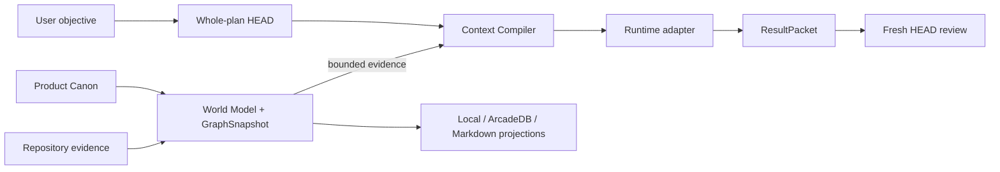
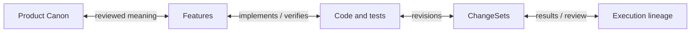

<div align="center">

# HEAD Agent Core Plugin

[English](README.md) | [한국어](README.ko.md)

**Keep product meaning, repository evidence, and agent execution connected<br>
without making a model session, Git host, or GraphDB the hidden source of truth.**

[](https://github.com/binary1215/head-agent-plugin/actions/workflows/go-worker-build-release.yml)


[Who it is for](#who-it-is-for) ·
[Why use it](#why-use-it) ·
[Install](#install) ·
[First project](#first-project) ·
[Core model](#core-model) ·
[Graph](#graph-and-records) ·
[Capabilities](#capability-status) ·
[Docs](#documentation)

</div>

## What HEAD Agent Core does

HEAD Agent Core is a provider-neutral control plane for AI coding agents. It
keeps four things connected across Claude Code, Codex, and OpenCode:

- user-owned product meaning;
- observed repository structure and change evidence;
- bounded, reproducible task context;
- execution results, review, and recovery lineage.

The project remains usable when a provider session disappears. Inferred product
concepts remain candidates until the user reviews them. Graphs and documents
remain rebuildable views instead of silently becoming authority.

## Who it is for

HEAD Agent Core is for people who must keep an AI-assisted product coherent
across more than one prompt, task, agent, or runtime.

| You are... | HEAD helps you... |
| --- | --- |
| A solo developer building a product over many AI sessions | Preserve intent, decisions, current position, and the next expected result without re-explaining the project from scratch. |
| A technical lead coordinating several agents or bounded workers | Separate HEAD, implementation, and review responsibilities while integrating results into one whole outcome. |
| A maintainer working in a large or long-lived repository | Select minimum sufficient evidence for one task instead of treating the whole repository as prompt context. |
| A team that uses Claude Code, Codex, OpenCode, or changing model providers | Keep one provider-independent `.head/` authority rather than separate project truth in each session. |
| A team that needs auditability, governance, or reliable handoff | Retain the evidence, explicit decisions, execution lineage, and recovery state behind each accepted change. |
| A product team connecting intent to implementation | Traverse reviewed Requirements and Features through code, tests, revisions, ChangeSets, and review evidence. |

It may be unnecessary for a one-off script, a short experiment with no recovery
needs, or work where conversation history is sufficient. It is also a poor fit
when inferred model output should be accepted without review, or when GraphDB is
expected to become the unquestioned source of project meaning.

## Why use it

The main reason to use HEAD Agent Core is to turn an agent's one-session
capability into reliable development continuity. It does not primarily make a
model write better code; it keeps the purpose, authority, evidence, and next
direction of many coding results from drifting apart.

| Common AI-development problem | What HEAD adds |
| --- | --- |
| A new or compacted session loses the actual direction | P2 checkpoints preserve purpose, approved decisions, current position, and the next expected result without trusting a conversation summary. |
| Model inference silently becomes a product decision | Candidates remain P3 evidence until an exact P1 ReviewDecision authorizes a scoped change. |
| More context creates more noise and less reproducibility | The Context Compiler selects bounded evidence under an explicit budget and records exclusions and Unknowns. |
| Agents and runtimes build different interpretations of the project | Claude Code, Codex, OpenCode, HEAD, and bounded workers operate from the same canonical `.head/` identities. |
| Code changes survive but their rationale disappears | Plans, contracts, ResultPackets, reviews, ChangeSets, and checkpoints form a verifiable execution lineage. |
| A graph or database gradually becomes hidden authority | GraphSnapshot, GraphDB, Markdown, and continuity remain rebuildable P4 views over verified Canon and records. |

> A conventional coding agent optimizes the current task. HEAD Agent Core
> optimizes for many tasks to accumulate into the same reviewed product
> direction.

## Install

Choose one installation path. The Codex marketplace path installs the
conversation Skill and typed MCP server. The user-scoped path also provides the
global `head-agent` command for automation and recovery.

### Codex Git marketplace

```powershell
codex plugin marketplace add binary1215/head-agent-plugin --ref codex-marketplace
codex plugin add head-agent-core@head-agent-plugin
```

Start a new Codex task so the installed Skill and MCP server are loaded, then
ask:

```text
Initialize or resume HEAD Agent onboarding for this project.
```

The marketplace install does not initialize a project, contact GraphDB, choose
a model, or approve Product Canon. Those transitions still require the typed
Core boundary and, where consequential, explicit user review.

### Claude Code and OpenCode

Use the user-scoped installation below, then initialize the project with
`--runtime claude,codex,opencode`. HEAD creates `CLAUDE.md` plus `.mcp.json` for
Claude Code, `AGENTS.md` for Codex, and `opencode.json` for OpenCode only when
those project files are absent. Existing files are preserved and generated
manual-integration projections remain under `.head/generated/`.

After initialization, start `claude` or `opencode` in the project. Claude Code
asks for project MCP approval before using the shared `head_core` server. The
runtime-native instruction/config files are projections; `.head/` remains the
only canonical HEAD state.

### User-scoped CLI

Requirements: a current Node.js LTS release and either Git or a downloaded
source archive. Git inside the target project, Go, GraphDB, and a provider
runtime are optional.

Windows PowerShell:

```powershell
git clone https://github.com/binary1215/head-agent-plugin.git
Set-Location .\head-agent-plugin
.\scripts\install.ps1 --native auto --project C:\path\to\project --runtime claude,codex,opencode

head-agent --version
head-agent doctor C:\path\to\project
```

macOS or Linux:

```bash
git clone https://github.com/binary1215/head-agent-plugin.git
cd head-agent-plugin
./scripts/install.sh --native auto --project /path/to/project --runtime claude,codex,opencode

head-agent --version
head-agent doctor /path/to/project
```

The installer stages a content-verified release in the current user's data
directory and writes launchers to `~/.local/bin`. It does not edit a shell
profile, a Codex cache, remote GraphDB, or an existing project before the
explicit `--project` initialization step.

## First project

### Conversation-first path

The bundled `head-agent-onboarding` Skill is the preferred interactive entry.
It inspects the current state, asks only for material choices such as repository
scope or storage mode, presents evidence-linked candidates, and uses explicit
review before Product Canon changes.

### CLI path

Initialize or resume the same project and HEAD Session identities:

```powershell
head-agent init C:\path\to\project --runtime claude,codex,opencode
head-agent onboarding-status C:\path\to\project
```

First use normally returns an immutable onboarding candidate-set ID. Inspect it
before review:

```powershell
$onboarding = head-agent onboarding-status C:\path\to\project | ConvertFrom-Json
head-agent onboarding-candidates C:\path\to\project `
  --candidate-set $onboarding.state.candidateSetId
```

Create `onboarding-review.json` only after reviewing the evidence. This compact
example accepts the complete bootstrap batch; selection or revision is safer
when any candidate should be renamed, split, merged, or excluded.

```json
{
  "candidateSetId": "onboarding-candidates-<id>",
  "disposition": "accept-all",
  "rationale": "I reviewed every evidence-linked candidate and adopt this bootstrap batch."
}
```

Apply the decision and verify the resulting views:

```powershell
head-agent onboarding-review C:\path\to\project --input .\onboarding-review.json
head-agent world-status C:\path\to\project
head-agent context-preview C:\path\to\project `
  --task "Find implementation evidence for one reviewed Feature" --budget 2000
head-agent world-docs-build C:\path\to\project
head-agent resume C:\path\to\project --runtime claude,codex,opencode
```

`accept-all` is supported for a fully inspected batch, but it is not the default
recommendation. Review can instead accept a dependency-complete selection,
revise or reject the batch, request more evidence, or retain explicit Unknowns.
See [Onboarding](docs/onboarding.md) for the complete contract.

### Source scope

For repositories with generated output, vendored dependencies, copied projects,
large fixtures, or model bundles, define a project-relative observation boundary
before the first index:

```json
{
  "mode": "existing",
  "sourceScope": {
    "includeRoots": ["src", "packages"],
    "excludeRoots": ["dist", "vendor", "generated", "fixtures"]
  }
}
```

Pass it with `head-agent init ... --input .\onboarding.json`. Source Scope
controls observation only; it cannot define Product Canon, approve a candidate,
or grant execution authority.

## Core model

HEAD separates meaning, recovery, evidence, views, and effects so that one
representation cannot inherit another's authority.

| Plane | Owns | Examples | Does not authorize |
| --- | --- | --- | --- |
| P1 Normative authority | approved meaning and explicit decisions | Product Canon, ReviewDecision | inference from a graph, result, or message |
| P2 Recovery and lineage | provider-independent project direction | Session, Run, plan, Capsule, contract, checkpoint | rewriting direction from a summary or result |
| P3 Evidence | reviewable observations and results | candidates, ResultPacket, ChangeSet, receipts | self-promotion or checkpoint authorship |
| P4 Derived views | reproducible retrieval and human views | GraphSnapshot, traversal, Markdown, continuity | Canon mutation or unique recovery |
| P5 Operational effects | host-local execution and delivery | PID, lease, endpoint, inbox, delivery receipt | execution, review, promotion, or recovery authority |

Distribution and host integrations package or execute these contracts; neither
becomes a sixth source of product meaning. The complete executable boundary is
documented in [Authority planes](docs/authority-plane-contract.md).

### Architecture at a glance



The feedback path is explicit: an accepted result may become reviewed lineage,
the repository can be re-indexed, and a later graph may project that evidence.
No result, projection, or runtime effect accepts itself.

### Minimum sufficient context

The Context Compiler selects task-relevant evidence under an explicit budget.
It records what was included, excluded, stale, missing, truncated, or unknown.
The same canonical inputs, compiler version, traversal policy, and budget
reproduce the same Context Capsule.

A Capsule is a derived execution input, not a second Canon. Digest or Canon drift
fails closed; simple read/reason work does not create a Capsule by default.

### Execution and recovery

Non-trivial execution follows a durable, reviewable sequence:

```text
WholePlanSnapshot
  → ExecutionContract + ContextCapsule
  → runtime or bounded worker
  → ResultPacket
  → Fresh HEAD ReviewDecision
  → accepted lineage or a revised plan
```

Provider loss does not require importing a transcript. `session-restore`
reconstructs the current input from the exact P2 checkpoint and verified lineage.
After an accepted result, `run-integrate-checkpoint` can bind that review to a new
checkpoint only when HEAD or the user explicitly supplies its recovery fields.

Intentional context compaction uses the same boundary:

1. `compact-prepare` freezes purpose, approved decisions, current position, and
   the next expected result;
2. provider compaction occurs outside Core;
3. `compact-verify` checks trusted real-user-turn evidence and rejects drift or
   summary-derived recovery;
4. `compact-continue` consumes one checkpoint-bound token.

A newer real user turn wins over a pending continuation. See
[Compaction recovery](docs/compaction-recovery.md) and
[Session recovery](docs/session-recovery.md).

### Product learning

Everyday observations can remain non-persisted notes. Durable artifacts are
created only when another Run, audit, product-state transition, or handoff needs
them:

```text
Signal → Hypothesis → Initiative candidate → user ReviewDecision
       → reviewed Initiative → accepted execution → OutcomeObservation
```

This is not one automatic promotion chain. Evidence remains evidence,
hypotheses remain hypotheses, and a reviewed Initiative remains distinct from
Product Canon. `head-agent operating-lane-recommend` can advise the lightest safe lane
without creating authority:

- Observe for read and reasoning work;
- Session for one bounded, reversible result;
- Run for dependent or recovery-sensitive work;
- Authority for Canon, initiative decisions, external writes, credentials, or
  recovery-canon changes.

See [Product Operating Loop](docs/product-operating-loop.md).

## Graph and records

A `GraphSnapshot` is the immutable, content-addressed evidence graph embedded in
one verified Repository World Model. It is not a graph UI screenshot, database
backup, or mutable latest-node collection. The same verified inputs produce the
same `graphSnapshotId`; semantic changes create a new snapshot with explicit
ancestry.

`head_world_model` verifies that complete model and current repository, then
returns a bounded status projection instead of transporting the full snapshot.
Counts, IDs, digests, samples, and omission metadata stay available; deeper
inspection uses the bounded graph, history, runtime, and semantic query tools.
This keeps MCP responses small without skipping any freshness or digest check.



Raw prompts stay outside this graph. Product meaning enters only through
reviewed Canon artifacts. Candidate nodes may be inspected explicitly, but are
excluded from default traversal and Context compilation.

### Graph versus record

The direction is deliberate:

```text
P1 Product Canon + observed source + verified P2/P3 records
  → P4 Repository World Model containing a recoverable GraphSnapshot
      → replaceable graph materialization: local JSON / optional ArcadeDB
      → replaceable human projection: Markdown
```

The graph owns navigation, not meaning or recovery direction. Deleting GraphDB
or generated Markdown must leave Product Canon, Session/Run recovery, and review
lineage intact. A stale, tampered, or semantically divergent projection fails
closed instead of redefining the graph.

### Query the graph

```powershell
head-agent world-status C:\path\to\project
head-agent world-temporal C:\path\to\project `
  --query "<Feature, symbol, path, ChangeSet, or ReviewDecision>" `
  --depth 3 --limit 100 --edge-limit 200
head-agent context-preview C:\path\to\project --task "<task>" --budget 4000
```

Traversal returns snapshot, query, and result identities plus inclusion,
exclusion, and truncation reasons. Embedded, local JSON, and activated ArcadeDB
backends must preserve the same semantic result.

## Runtime and coordination

Claude Code, Codex, and OpenCode are projections over one `.head/` authority. Runtime adapters
observe capability, consume one exact authorization at most once, supervise the
owned process tree, validate structured output, and keep operational state
outside the project.

Role coordination is intentionally small: send, read-inbox, bounded wait-reply,
and immutable reply. A trusted host binds each endpoint to one project role;
callers cannot assert their own sender role. Messages and delivery receipts are
evidence only and cannot create a ReviewDecision, widen a contract, mutate
Product Canon, or rewrite recovery direction.

Host-specific pane, socket, CLI, and UI behavior belongs in separately owned
optional adapters. The Core keeps provider-neutral endpoint, project-root,
fresh-snapshot, proof, acknowledgment, and cleanup fences. General provider
resume and streaming remain deferred. See [Runtime adapters](docs/runtime-adapters.md)
and [Role coordination](docs/role-coordination.md).

## Optional GraphDB

Local storage is the safe default. GraphDB is not required for onboarding,
context compilation, execution lineage, or recovery.

ArcadeDB can be explicitly activated as a derived graph projection. Credentials
are resolved only through environment-variable references and never enter
project artifacts, graph identities, generated documents, or receipts. Remote
activation must prove semantic conformance with the recoverable embedded graph.

The JavaScript bridge is the semantic reference. When a verified native package
is present, read-only prepared queries may use a content-addressed Go query-batch
bridge; JavaScript still verifies the pointer, topology, traversal, request
binding, and receipt. Set `HEAD_AGENT_ARCADEDB_NATIVE_MODE` to:

- `auto` — use the verified native bridge when available, otherwise disclose and
  use the JavaScript reference path;
- `off` — always use the JavaScript path;
- `required` — fail when the verified native path is unavailable.

Manifest, binary, and post-selection digest mismatches always fail closed.
Exact children receive only configured credential-reference variables and a
bounded OS, TLS, locale, and proxy allowlist. The compute worker itself remains
network-free and authority-free. See
[Graph projection adapter](docs/graph-projection-adapter.md).

## Installation lifecycle

### Native packages

User-scoped install and upgrade default to `--native auto`. The installer selects
the exact version and platform package, verifies release checksum, archive paths,
build metadata, and native manifests, then includes the binaries in the release
identity. Use `--native off` for JavaScript-only installation or
`--native required` when fallback is unacceptable.

Native components have separate contracts for authority-free computation, owned
process supervision, and read-only ArcadeDB batching. Installing one never
changes Product Canon, graph identity, review authority, or lineage.

### Status, upgrade, rollback, and removal

Run lifecycle commands from the newly downloaded source tree:

```powershell
node .\scripts\distribution.mjs upgrade
node .\scripts\distribution.mjs status
node .\scripts\distribution.mjs rollback
node .\scripts\distribution.mjs uninstall
```

Upgrade stages and verifies an immutable release before replacing the active
pointer. Normal removal deletes launchers and the active pointer but preserves
verified releases for recovery. `uninstall --purge` also removes the user-scoped
release store. Neither form traverses or deletes project `.head` state, Git data,
generated project documents, or GraphDB data.

Provider configuration and authentication remain owned by Claude Code, Codex,
or OpenCode. HEAD passes only the exact authorized `provider/model` plus an
ephemeral permission/privacy overlay; it does not install provider presets,
copy credentials, or rewrite endpoints.

## Capability status

Status labels are evidence claims, not roadmap promises:

- **Available** — implemented in the current source distribution;
- **Experimental** — implemented behind an explicit or limited activation path;
- **Planned** — accepted direction but not shipped;
- **Deferred** — intentionally outside the current milestone.

| Area | Capability | Status |
| --- | --- | --- |
| Project | initialization, Source Scope, review-gated Product Canon | **Available** |
| Knowledge | World Model, incremental refresh, Context Capsules | **Available** |
| Lineage | Runs, ResultPackets, Fresh HEAD review, Session restore, compaction | **Available** |
| Runtime | Claude Code, Codex, and OpenCode one-shot Session/Run execution | **Available** |
| Runtime evidence | deterministic three-runtime fixtures and local CLI capability probes | **Available** |
| Runtime evidence | Claude Code live model-call conformance | **Experimental** |
| Workers | bounded dispatch, wait, result, review, integration | **Available** |
| Coordination | durable role messaging and exact-endpoint host delivery | **Available** |
| Projection | local graph and Markdown | **Available** |
| Projection | ArcadeDB | **Experimental** |
| Distribution | user-scoped install, native delivery, rollback, safe removal | **Available** |
| Distribution | verified Git-backed Codex marketplace | **Available** |
| Distribution | OpenAI universal plugin directory | **Planned** |
| Runtime | general provider-session resume and streaming | **Deferred** |
| Documents | Obsidian and Notion adapters | **Deferred** |

For exact claims and acceptance evidence, use the subsystem documents and source
verification rather than inferring capability from this summary.

## Design principles

HEAD Agent Core Plugin is inspired by
[Won6314/head-agent-core](https://github.com/Won6314/head-agent-core) and
independently reworked as a provider-neutral plugin. It is not an official
upstream release or a drop-in replacement. See the
[source-grounded comparison](docs/original-head-core-comparison.md).

This implementation retains the foundational HEAD principles while expressing
them through provider-neutral contracts:

- HEAD owns the connected whole outcome;
- the user retains consequential authority;
- minimum sufficient context beats maximum context;
- durable Canon survives temporary model sessions;
- delegation stays bounded and non-authoritative;
- completion requires connected primary evidence;
- graphs are retrieval indexes, not unquestioned authority;
- project meaning remains separate from runtime mechanisms.

Read the upstream
[Foundations](https://github.com/Won6314/head-agent-core/blob/main/packages/core/docs/FOUNDATIONS.md)
and
[Technical Architecture](https://github.com/Won6314/head-agent-core/blob/main/packages/core/docs/TECHNICAL_ARCHITECTURE.md)
for the original design context.

## Documentation

Start with these documents:

- [Architecture](docs/architecture.md) — the provider-neutral composition;
- [Authority planes](docs/authority-plane-contract.md) — the executable
  Graph/record and non-amplification contract;
- [Onboarding](docs/onboarding.md) — candidate inference and explicit review;
- [Context Compiler](docs/context-compiler.md) — reproducible task context;
- [Execution Lineage](docs/execution-lineage.md) — plans, contracts, results,
  review, and recovery;
- [World Model](docs/world-model.md) — source evidence and graph construction;
- [Runtime adapters](docs/runtime-adapters.md) — capability, invocation, and
  process ownership;
- [Performance fast path](docs/performance-fast-path-design.md) — optimization
  without semantic or authority shortcuts.

Additional references:

- [Product Model](docs/product-model.md)
- [Product Operating Loop](docs/product-operating-loop.md)
- [Incremental refresh](docs/incremental-refresh.md)
- [Compaction recovery](docs/compaction-recovery.md)
- [Session recovery](docs/session-recovery.md)
- [Role coordination](docs/role-coordination.md)
- [Graph projection adapter](docs/graph-projection-adapter.md)
- [Document projection adapter](docs/document-projection-adapter.md)
- [Codex marketplace distribution](docs/codex-marketplace.md)

Installed behavior is governed by these runtime contracts, the target project's
user-owned Canon, current Session/Run recovery state, and explicit
ReviewDecisions. Repository-development history, benchmark fixtures, and
maintainer milestones are evidence about the plugin; they are not instructions
for a project using it.

## Verify from source

```powershell
npm test
npm run verify:newcomer
npm run verify:distribution
npm run verify:codex-marketplace
```

Native sources additionally support `go test ./...` and `go vet ./...` from the
corresponding module directories. JavaScript remains the semantic reference;
native backends are advertised only after fixture-driven conformance and
integrity verification.

## Status and licensing

HEAD Agent Core Plugin is alpha software. The repository remains `UNLICENSED`
until an explicit distribution license is selected. Public source availability
alone does not grant redistribution or derivative-use rights.
