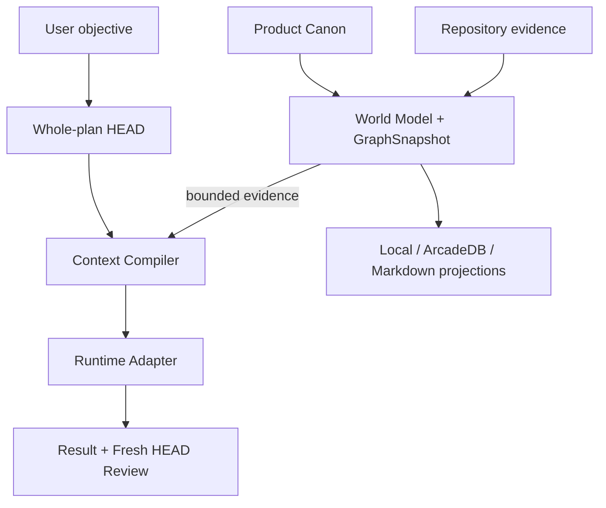
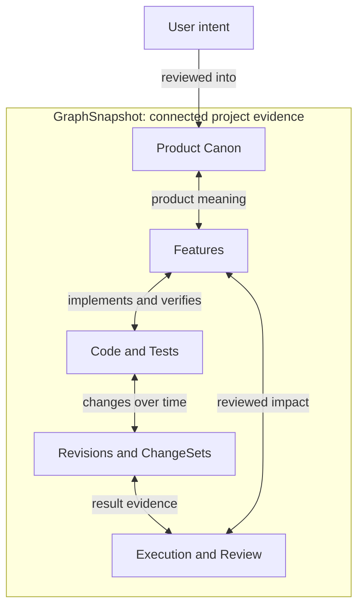

<div align="center">

# HEAD Agent Core Plugin

**Keep user intent, Product Canon, code, change history, and agent execution<br>
connected across Codex, OpenCode, and future runtimes.**

[](https://github.com/binary1215/head-agent-plugin/actions/workflows/go-worker-build-release.yml)


[Why HEAD](#why-this-architecture-is-different) ·
[Architecture](#architecture-at-a-glance) ·
[GraphSnapshot](#what-is-a-graphsnapshot) ·
[Try the graph](#try-the-graph) ·
[Installation](#installation) ·
[Status](#implementation-status)

</div>

> **Design lineage**
>
> Inspired by [Won6314/head-agent-core](https://github.com/Won6314/head-agent-core)
> and independently reworked as a provider-neutral plugin. This is not an
> official upstream release or a drop-in replacement.
> The adopted principles, structural differences, verified advantages, and
> remaining gaps are recorded in the
> [original HEAD Core comparison](docs/original-head-core-comparison.md).

## What is HEAD Agent Core?

HEAD Agent Core is a provider-neutral control plane for AI coding agents. It
turns project meaning, repository structure, change history, and execution
evidence into one reviewable system without making a chat session, Git host, or
GraphDB the hidden source of truth.

Instead of asking every new agent session to reconstruct the project from
conversation history, HEAD preserves user-owned Product Canon, builds an
immutable evidence graph, compiles task-bounded context, executes through a
runtime adapter, and requires a fresh review before a result becomes accepted
lineage.

The runtime, unified graph, and projections are shown together in
[Architecture at a glance](#architecture-at-a-glance).

## Five-minute local quick start

This path needs Node.js and a project directory. It does not require Git inside
the target project, GraphDB, Go, or an existing Feature catalog.

```powershell
git clone https://github.com/binary1215/head-agent-plugin.git
Set-Location .\head-agent-plugin
.\scripts\install.ps1 --native auto --project C:\path\to\project --runtime codex,opencode

head-agent --version
head-agent doctor C:\path\to\project
head-agent onboarding-status C:\path\to\project
head-agent world-status C:\path\to\project
```

On first use, `init` observes the repository and returns either
`awaiting_onboarding_review` with an immutable candidate-set ID or
`awaiting_onboarding_evidence` when the selected source scope contains too
little evidence. It does not silently turn inferred Features into Product
Canon. Inspect the returned candidate set, prepare an explicit review JSON,
and apply it through `head-agent onboarding-review ... --input <file>` as shown
in [Project onboarding](#project-onboarding).

If `native.status` reports `javascript-fallback`, onboarding and graph work are
still available through the semantic-reference implementation. Re-run install
or upgrade with `--native required` only when a native package is mandatory.
No command above writes to a remote GraphDB unless that projection is
separately configured and explicitly activated.

## Conversation-first onboarding

The preferred interactive path is now the bundled `head-agent-onboarding`
Skill. In Codex or OpenCode, ask HEAD Agent to initialize or resume the current
project. The Skill uses the typed MCP/Core boundary to:

1. inspect the current project and onboarding state,
2. ask only for material choices such as repository scope and storage mode,
3. initialize or resume the same project and HEAD Session identities,
4. present bounded, evidence-linked Feature candidates for explicit review,
5. verify the World Model, graph projection, Context Compiler, and derived
   Markdown projection.

Inferred Features do not become Product Canon merely because onboarding is
conversational. Candidate acceptance, rejection, or editing remains an explicit
user decision. Endpoint values and credentials remain operational inputs and
are not copied into the project graph or generated documents.

The Git-backed Codex marketplace distribution installs this Skill and MCP
server together. The CLI quick start above remains the recovery and automation
interface, not a separate authority model. Submission to OpenAI's universal
public plugin directory is a separate publisher-owned review step.

## Why this architecture is different

| Common failure mode | HEAD Agent Core response |
| --- | --- |
| A provider conversation becomes project memory | Project identity, Canon, graph, and lineage survive provider-session loss. |
| A code graph cannot explain product meaning | Reviewed Feature-to-code/test relations connect intent to implementation. |
| Model inference silently becomes authority | Features, mappings, impacts, and document edits remain candidates until explicitly reviewed. |
| History depends entirely on Git | SourceSnapshot, Revision, and ChangeSet DAGs preserve lineage without requiring Git. |
| A database backend becomes the real source of truth | The World Model retains a recoverable GraphSnapshot; storage and document backends remain replaceable projections. |
| More prompt context is treated as better context | The Context Compiler selects bounded, reproducible evidence for one task. |
| Runtime support forks the core architecture | Provider-neutral HEAD Session and Run identities are executed through runtime adapters. |
| An agent can claim another role in a message | The trusted host binds the endpoint role; send/read/reply arguments contain neither sender role nor binding token. |

## Product learning without authority drift

The Product Operating Loop keeps one connected, reviewable path without forcing every thought into storage. Everyday observations, hypotheses, and inferred meanings start as non-persisted epistemic notes with no content identity or graph rebuild. They become immutable artifacts only when a handoff, audit, product-state, or cross-Run boundary needs recovery:

```text
Signal (observed fact)
  -> Hypothesis
  -> Initiative candidate
  -> explicit user ReviewDecision
  -> reviewed Initiative
  -> existing Feature, Feature candidate, or explicit mapping gap
  -> accepted ChangeSet execution
  -> OutcomeObservation
```

This is deliberately not one promotion chain. Signals and outcomes are evidence, hypotheses are hypotheses, Feature proposals remain candidates, and a reviewed Initiative is still separate from Product Canon. An OutcomeObservation must bind to an accepted `ResultPacket`/execution `ReviewDecision` through a `ChangeSet`; it does not mark a Feature successful. The resulting Product Graph is a rebuildable local projection and may later be materialized to GraphDB without making the database an orchestrator or authority.

An Initiative may be proposed directly from explicit inline reasoning. Feature resolution can wait until the user accepts it, so the default path creates no `ProductFeatureCandidate` before review. `head operating-lane-recommend` selects the lightest safe advisory lane: Observe for read/reason work, Session for one bounded reversible result, Run for dependent or recovery-sensitive work, and Authority only for Product Canon, Initiative decisions, external writes, credentials, or recovery-canon changes. The recommendation has no authority effect; the selected Core operation still enforces the real boundary.

`head help` shows only the light conversational surface. The lane recommendation
is optional, not a prerequisite. Use `head help-all` for advanced, compatibility,
audit, and recovery commands, including the durable Signal/Hypothesis paths.

`head head-continuity <project>` returns an on-demand exact-reference view over current Session, Run, lineage, product, and graph identities. Repeated same-process status/continuity reads may reuse a disclosed snapshot/content-identity cache; writes invalidate it and `--fresh` forces full verification. The view is not persisted and cannot replace Session/Run checkpoints or continuous whole-outcome HEAD judgment. See [Product Operating Loop](docs/product-operating-loop.md).

Intentional context compaction uses an explicit advanced recovery flow. `compact-prepare` first writes a canonical purpose/decision/position/next-result checkpoint, provider compaction happens outside Core, `compact-verify` rejects summary-based or drifted recovery, and `compact-continue` consumes one checkpoint-bound token. A newer real user turn wins and invalidates the pending continuation. No provider session identity, Git object, or GraphDB record is required. See [Compaction recovery](docs/compaction-recovery.md).

Provider loss does not require provider-session resume. `session-restore` rebuilds
the same deterministic consumer input from the current content-addressed
Session/Run checkpoint and verified plan/contract/Capsule artifacts. A bounded
worker result remains P3 evidence until Fresh HEAD records an explicit accept
ReviewDecision; only then can `run-integrate-checkpoint` bind that reviewed result
once to a P2 recovery checkpoint whose next direction is supplied explicitly by
HEAD/user input. See [Session restore and reviewed-result integration](docs/session-recovery.md).
The original mapping remains explicit: HF-007 is compaction, HF-008 is Session
restore, HF-009 is worker dispatch, and HF-010 is completed-worker integration.
Run `npm run verify:hostless-session-recovery` to prove the provider-neutral
resident-consumer outcome, crash convergence, missing-evidence disclosure, and
inbox non-authority without Git, GraphDB, WorkspaceHost, Herdr, or provider resume.

Provider-neutral role coordination is an advanced host-bound surface. A trusted
administrator opens one coordination generation and issues a one-time binding
token for a verified project role. The endpoint then exposes exactly send,
read-inbox, bounded wait-reply, and reply; role and token are not message arguments. Inboxes,
idempotency, read markers, immutable replies, and delivery receipts live in the
external operational root and never mutate `.head` or Product Canon. Messages
have no instruction, decision, review, execution, promotion, or Canon authority.
When a dedicated MCP endpoint is started by a trusted workspace host, an active
`VerifiedWorkspaceHostAdapter` binds its process-injected caller to one fresh,
unique endpoint and revalidates the exact target before and after delivery. The
plugin accepts only the provider-neutral `WorkspaceHostDriver` snapshot/send
contract; host-specific executable, socket, CLI, pane, and TUI knowledge belongs
in a separately owned optional adapter. The production `host-export` reference
uses content-addressed snapshots and create-only filesystem request/ack records
outside the project, with a create-only pre-effect claim preventing automatic
replay after an uncertain host crash. Each endpoint is uniquely bound to the
current coordination binding and a host-issued per-process proof whose secret
never enters project state or receipts. A trusted snapshot may register a current
recipient binding before its provider process starts, but that registration grants
reachability only: the new process must still possess its distinct raw proof and
pass the same fresh binding check on its first tool call. Requests, claims, and
acknowledgments bind the exact recipient binding. Copied tuples,
foreign/replaced bindings, forged/old proofs, explicit detach, and duplicate
ownership fail closed. An actual already-running Codex HEAD waits before an
OpenCode worker sends its authority question; claim/ack targets the replaced
current endpoint without spawning a provider, the stale endpoint receives
nothing, and OpenCode boundedly waits for HEAD's non-authoritative reply without
creating a `ReviewDecision`. `.head` stays byte-identical, provider sessions and
control tokens do not persist, and separate real Codex/OpenCode clients prove
owned-tree one-shot interrupt/close cleanup while resume/stream stay disabled.
See [Role coordination](docs/role-coordination.md).

## Architecture at a glance

HEAD Agent Core uses one connected architecture for planning, repository
understanding, execution, review, and human-readable projection. The graph is
not a separate analytics feature: it is the evidence layer that lets each stage
refer to the same product, source, revision, decision, and execution identities.



An accepted review is recorded as new lineage and can produce the next verified
World Model and GraphSnapshot. That feedback step is described here instead of
drawn as a loop so the primary execution path stays easy to read.

### What is a GraphSnapshot?

A `GraphSnapshot` is the immutable, content-addressed evidence graph embedded in
one verified Repository World Model. It captures the complete graph state HEAD
can reproduce at a specific indexing, refresh, or reviewed authority-transition
boundary.

It is not a screenshot of a graph UI, a database backup, or a mutable collection
of the latest nodes. The snapshot canonically sorts and hashes its inputs,
nodes, edges, and parent identities. The same verified inputs produce the same
`graphSnapshotId`; any semantic change produces a new snapshot while prior
snapshots remain immutable.

The snapshot is a connected topology, not a set of isolated catalogs. Canonical
edge directions preserve meaning, while bounded traversal can start from either
endpoint and explore the relationship in either direction.



`User intent` is shown outside the snapshot deliberately. Raw prompts do not
become graph authority. Only intent captured through reviewed Product Canon
artifacts such as Requirements, Constraints, Decisions, and Features enters the
snapshot.

<details>
<summary><strong>See how this semantic graph is encoded</strong></summary>

The picture stays intentionally semantic. The implementation preserves the
exact relationship vocabulary underneath it:

| Meaning | Graph relations |
| --- | --- |
| Product structure and governance | `CONTAINS`, `REALIZES`, `GOVERNED_BY` |
| Feature-to-implementation mapping | `IMPLEMENTS`, `VERIFIED_BY` |
| Immutable state and ancestry | `HAS_REVISION`, `CURRENT_REVISION`, `PARENT_OF` |
| Change and product impact | `CHANGES`, `SUPERSEDES`, `IMPACTS` |
| Evidence and review | `SUPPORTED_BY`, `REVIEWED_BY`, `PRODUCES`, `PROMOTED_FROM` |

| Question | GraphSnapshot contract |
| --- | --- |
| What is it bound to? | Exact Project, Product Model, SourceSnapshot, protocol, and parent identities. |
| What does it contain? | Product concepts, code and test entities, immutable revisions, typed relations, reviewed mappings and impacts, ChangeSets, decisions, evidence, and lineage references. |
| What does every record preserve? | Origin, evidence IDs, freshness, producer, authority class, and instruction/promotion flags. |
| When does it change? | When verified semantic inputs change through indexing, refresh, accepted review, or accepted execution evidence; no-change rebuilds retain the same identity. |
| How is history represented? | SourceSnapshots, revisions, and ChangeSets allow zero or more parents, forming DAGs without claiming automatic merge behavior. |
| Where is it stored? | Recoverably inside the World Model, then optionally materialized through local JSON or ArcadeDB and rendered into documents. |
| Is it project authority? | No. It is `derived-evidence-only`; Product Canon, observed source, and explicit review records retain their respective authority. |

</details>

### Traverse from any anchor

The graph preserves canonical edge direction in storage and results, but a
bounded neighborhood traversal can follow incident relationships from either
endpoint. Product, implementation, history, and provenance therefore remain
different views of the same verified snapshot.

| Start from | Traverse through | Discover |
| --- | --- | --- |
| Requirement or Decision | Feature → reviewed mapping | Implementing code, tests, revisions, and change history. |
| Feature | Canon relations or reviewed mappings | Originating intent, parent Capability, code, tests, and reviewed impacts. |
| File or Symbol | Revision and reviewed mapping | Related Features, ChangeSets, tests, and review evidence. |
| ChangeSet | Changed revisions and reviewed impacts | Exact code changes, affected Features, and Product Canon context. |
| ReviewDecision | Candidate, Evidence, and produced receipt | Why a Feature, mapping, impact, or Canon revision was accepted or rejected. |

```text
Reviewed intent → Canon → Feature → Code / Test → Revision → ChangeSet
ChangeSet → Revision → Code → Feature → Canon → reviewed intent
Code → Feature → reviewed impact → ChangeSet → Result Packet / ReviewDecision
```

Git may attach optional VCS evidence, but it does not define ChangeSet or graph
identity. Inferred Features, mappings, impacts, and document edits stay in
explicit candidate surfaces until a scoped user review accepts them.

### Try the graph

After project initialization and onboarding, the source CLI exposes the same
graph through bounded, digest-verified queries. These commands are available in
the current alpha:

```text
# Verify that the indexed World Model and GraphSnapshot are current
node scripts/head.mjs world-status <project>

# Start from a Feature, symbol, file path, ChangeSet, or ReviewDecision
node scripts/head.mjs world-temporal <project> --query "<anchor>" --depth 3 --limit 100 --edge-limit 200

# Preview the exact bounded evidence an agent would receive for one task
node scripts/head.mjs context-preview <project> --task "<task>" --budget 4000

# Render the verified graph as a human-readable Markdown projection
node scripts/head.mjs world-docs-build <project>
```

`world-temporal` returns the snapshot, query, and result identities together
with inclusion, exclusion, and truncation reasons. The same semantic result is
required whether traversal uses the embedded graph, local JSON, or an activated
ArcadeDB projection.

### Graph, database, and documents have different roles

The authority and projection direction is deliberately one-way:

```text
User-owned Product Canon + observed source + verified reviews and lineage
  → Repository World Model containing a recoverable GraphSnapshot
      → replaceable graph materialization: local JSON / optional ArcadeDB
      → replaceable human projection: Markdown / future Obsidian or Notion
```

ArcadeDB record IDs, filesystem paths, provider page IDs, and adapter names do
not enter semantic identity. A missing projection can be rebuilt from the
verified World Model; a stale, tampered, or semantically divergent projection
fails closed instead of redefining the graph.

The Context Compiler also never copies the whole graph into a model prompt. It
performs task-specific bounded traversal and records selected and excluded
evidence, stale or missing inputs, truncation, and explicit Unknowns. The same
canonical inputs, compiler version, traversal policy, and token budget reproduce
the same Context Capsule.

## Implementation status

Status terms in this README have exact meanings:

- **Available** — implemented and usable through the current source distribution.
- **Experimental** — implemented behind an explicit or limited activation path.
- **Planned** — accepted direction, but not shipped in the current alpha.
- **Deferred** — intentionally outside the current milestone.

| Capability | Status |
| --- | --- |
| Source-based CLI execution | **Available** |
| One-command install, initialize, and onboarding resume | **Available** |
| Conversation-guided onboarding Skill and typed MCP init/review/docs flow | **Available** |
| Project initialization and project-scoped HEAD Session | **Available** |
| Repository Source Scope | **Available** |
| Review-gated onboarding and Product Canon bootstrap | **Available** |
| Repository World Model and incremental refresh | **Available** |
| Context Compiler and reproducible Context Capsules | **Available** |
| Execution Lineage and Fresh HEAD review | **Available** |
| Codex Session and Run execution | **Available** |
| Go worker and native process supervision | **Available** |
| Local graph and Markdown projections | **Available** |
| ArcadeDB graph projection | **Experimental** |
| OpenCode project projection | **Available** |
| OpenCode one-shot Session and Run execution | **Available** |
| Artifact-only Codex-to-OpenCode provider replacement recovery | **Available** |
| Host-bound durable role messaging Core/CLI/MCP | **Available** |
| Exact-endpoint two-process WorkspaceHost delivery | **Available** |
| Production host-export filesystem bridge | **Available** |
| Actual Codex/OpenCode provider-client live role round trip | **Available** |
| Host-specific WorkspaceHost adapters | **Optional external** |
| Verified Git-backed Codex marketplace distribution | **Available** |
| OpenAI universal plugin directory publication | **Planned** |
| `install.ps1` and `install.sh` | **Available** |
| User-scoped global `head-agent` command | **Available** |
| `head-agent --version` and project `head-agent doctor` | **Available** |
| Automatic verified native binary installation | **Available** |
| Recoverable upgrade, verified rollback, and safe removal | **Available** |
| Provider-session resume and durable attachment | **Deferred** |
| Obsidian and Notion projection adapters | **Deferred** |

## Installation

### Requirements

- a current Node.js LTS release;
- Git or a downloaded source archive for the initial source distribution;
- Codex or OpenCode only when using the corresponding live execution adapter;
- Go only when building native worker and supervisor binaries locally;

OpenCode provider configuration remains owned by OpenCode. HEAD passes the exact
authorized `provider/model`, adds only its ephemeral permission/privacy overlay,
and lets OpenCode resolve its global provider definitions and authentication.
HEAD does not install an OpenAI, LiteLLM, or other provider preset, and it does
not rewrite a configured endpoint. Project-local OpenCode configuration and
external plugins remain disabled during the isolated one-shot invocation.
- ArcadeDB only when explicitly enabling the optional remote graph projection.

Git, Go, GraphDB, and a provider runtime are not prerequisites for HEAD project
identity, local lineage, installation rollback, or local recovery. The
JavaScript reference path remains available when native compute is absent.

### User-scoped installation — available now

The installer copies a verified, content-identified release into the current
user's data directory and writes `head-agent` launchers to `~/.local/bin`. It
does not edit a Codex cache, shell profile, project `.head` directory, or remote
GraphDB. Add `~/.local/bin` to `PATH` once if the installer reports
`pathConfigured: false`.

#### Windows PowerShell

```powershell
git clone https://github.com/binary1215/head-agent-plugin.git
Set-Location .\head-agent-plugin
.\scripts\install.ps1 --project C:\path\to\project --runtime codex,opencode

head-agent --version
head-agent doctor C:\path\to\project
```

#### macOS or Linux

```bash
git clone https://github.com/binary1215/head-agent-plugin.git
cd head-agent-plugin
./scripts/install.sh --project /path/to/project --runtime codex,opencode

head-agent --version
head-agent doctor /path/to/project
```

Installation defaults can be overridden without changing product canon:

```powershell
.\scripts\install.ps1 --install-root C:\user-data\head-agent --bin-dir C:\user-bin
```

```bash
./scripts/install.sh --install-root "$HOME/.head-agent" --bin-dir "$HOME/bin"
```

These locations are operational configuration only. They never participate in
project, graph, Context Capsule, or execution-lineage semantic identity.

### Codex Git marketplace installation — available now

The `codex-marketplace` branch is generated only after the integrated test job
and all five native build targets succeed. It contains a minimal marketplace
catalog plus a content-verified plugin distribution; development-only trees,
Git metadata, test fixtures, dependency caches, and local build output are not
published into the plugin snapshot.

```powershell
codex plugin marketplace add binary1215/head-agent-plugin --ref codex-marketplace
codex plugin add head-agent-core@head-agent-plugin
```

Start a new Codex task after installation so the bundled
`head-agent-onboarding` Skill and `head_core` MCP server are loaded. Then ask:

```text
Initialize or resume HEAD Agent onboarding for this project.
```

The marketplace installs the conversation layer; it does not initialize a
project, contact GraphDB, select a model, or promote inferred Product Canon.
Those transitions still occur through the typed Core boundary and explicit
review. See [Codex marketplace distribution](docs/codex-marketplace.md) for
upgrade, removal, generated-branch ownership, and public-directory boundaries.

### Upgrade, status, rollback, and removal

Run lifecycle commands from the newly downloaded source tree. `install` and
`upgrade` stage and verify an immutable release before replacing the active
pointer. If staging or verification fails, the previous pointer remains active.

```powershell
node .\scripts\distribution.mjs upgrade
node .\scripts\distribution.mjs status
node .\scripts\distribution.mjs rollback
node .\scripts\distribution.mjs uninstall
```

```bash
node ./scripts/distribution.mjs upgrade
node ./scripts/distribution.mjs status
node ./scripts/distribution.mjs rollback
node ./scripts/distribution.mjs uninstall
```

Normal removal deletes the active pointer and launchers but preserves immutable
release files so recovery remains possible. `uninstall --purge` also removes
the user-scoped release store. Neither form traverses or deletes any project's
`.head` canon, lineage, document projection, Git repository, or GraphDB data.

The source tree remains directly runnable when a global installation is not
desired:

```powershell
node .\scripts\head.mjs init C:\path\to\project --runtime codex
```

The native compute worker is optional. Installation and upgrade default to
`--native auto`: the installer selects the current OS/architecture package for
the exact plugin version, downloads its release checksum and `tar.gz`, rejects
unsafe archive entries, verifies build metadata plus both native manifests,
and only then includes the binaries in the immutable release identity. A
missing release package produces a disclosed JavaScript fallback; a checksum,
archive, or manifest mismatch fails closed. Use `--native off` for a fully
offline JavaScript-only install or `--native required` when fallback is not
acceptable.

```powershell
node .\scripts\distribution.mjs install --native required
node .\scripts\distribution.mjs upgrade --native auto
```

OpenAI universal plugin-directory submission remains planned and requires a
publisher-owned review. Git marketplace installation is already available.
Native download success never changes Product Canon, graph identity, review
authority, or execution lineage.

The current installer:

1. validates matching plugin/package versions and rejects symlinked input;
2. hashes every included file into one content-derived release identity;
3. stages, verifies, and activates the release without in-place source edits;
4. installs PowerShell/cmd and POSIX-compatible command launchers;
5. keeps prior verified releases available for explicit rollback;
6. optionally initializes or resumes one project through the installed release;
7. automatically acquires and verifies the matching native package when one is
   published, while preserving a disclosed JavaScript fallback in `auto` mode.

Verify the full isolated lifecycle without touching the real user installation:

```powershell
npm run verify:distribution
npm run verify:native-delivery
npm run verify:codex-marketplace
```

## Project onboarding

Onboarding initializes HEAD project identity, observes the repository, and
creates a reviewable product-model candidate batch. It does **not** automatically
promote inferred Features into Product Canon.

The examples below use the currently available source CLI. Replace
`C:\path\to\project` with the target project root.

### 1. Initialize or resume the project

`init` is the public composition path. On first use it creates one project and
HEAD Session identity, indexes the selected source scope, and creates the
reviewable onboarding candidate batch. Repeating `init` or using its `resume`
alias verifies and returns the same pending review or ready state without
duplicating project, Session, candidate, or Product Canon authority.

```powershell
head-agent init C:\path\to\project --runtime codex,opencode
head-agent resume C:\path\to\project --runtime codex,opencode
```

When a source boundary or new-project brief is needed, supply it on the first
command so it is applied before indexing:

```powershell
head-agent init C:\path\to\project --runtime codex,opencode `
  --input .\onboarding.json
```

Initialization creates protected `.head/` project state, a project-scoped HEAD
Session, onboarding state, an empty user-owned Product Model, and an immutable
candidate batch. OpenCode uses the same project identity and onboarding state;
fresh-process provider replacement is verified from HEAD artifacts alone, and
live OpenCode Session/Run execution is verified through the user's own resolved
OpenCode provider settings.

### 2. Select the repository source scope before indexing

For repositories containing generated output, vendored dependencies, copied
projects, model bundles, or large fixtures, record the exact project-relative
roots that should participate in product inference.

```json
{
  "mode": "existing",
  "sourceScope": {
    "includeRoots": ["src", "packages"],
    "excludeRoots": ["dist", "vendor", "generated", "fixtures"]
  }
}
```

Source Scope controls observation only. It cannot define Product Canon, approve
an inferred Feature, or grant execution authority.

### 3. Inspect onboarding

```powershell
head-agent onboarding-status C:\path\to\project
```

For an existing project, HEAD indexes the selected source scope and proposes
evidence-linked FeatureGroup, Capability, and Feature candidates. Related
implementation symbols are clustered into bounded behavior concepts while
generic lifecycle, UI-handler, logging, and serialization helpers are
deprioritized or excluded. Inferred FeatureGroups are not automatically applied
to unrelated Features. A new project can instead begin from a structured
user-authored brief.

### 4. Review inferred product concepts

Inspect the immutable candidate batch before promotion:

```powershell
$onboarding = head-agent onboarding-status C:\path\to\project | ConvertFrom-Json
head-agent onboarding-candidates C:\path\to\project `
  --candidate-set onboarding-candidates-<id>
```

After inspecting every candidate and its evidence, create an explicit review.
The following bootstrap shortcut accepts the complete batch; replace the
rationale with your own judgment. Use the selection or revise forms documented
in [Onboarding](docs/onboarding.md) when any candidate should be excluded,
renamed, merged, or split.

```json
{
  "candidateSetId": "onboarding-candidates-<id>",
  "disposition": "accept-all",
  "rationale": "I reviewed every evidence-linked candidate and adopt this bootstrap batch."
}
```

Save that document as `onboarding-review.json`, then apply it:

```powershell
head-agent onboarding-review C:\path\to\project `
  --input .\onboarding-review.json
```

A review may accept a dependency-complete selection, revise the candidate set,
reject it, request additional evidence, or retain unresolved concepts as
explicit Unknowns. `accept-all` is supported by the contract but is not the
recommended default onboarding path.

Verify the ready graph and try one bounded task context without persisting a
Capsule. The document command creates a replaceable Markdown projection under
the project-owned `.head` state; it does not change Product Canon.

```powershell
head-agent onboarding-status C:\path\to\project
head-agent world-status C:\path\to\project
head-agent context-preview C:\path\to\project `
  --task "Find the implementation evidence for one reviewed Feature" --budget 2000
head-agent world-docs-build C:\path\to\project
head-agent resume C:\path\to\project --runtime codex,opencode
```

See [Onboarding](docs/onboarding.md) and
[Product Model](docs/product-model.md) for the complete review contracts.

## Optional GraphDB configuration

Local JSON storage is the safe default. GraphDB is not required to initialize,
onboard, compile context, or preserve execution lineage.

ArcadeDB can be activated explicitly as a derived graph projection. Credentials
are resolved only from environment-variable references; secret values must not
be written into project artifacts, graph identities, generated documents, or
execution receipts. Remote activation must pass local/remote conformance before
it becomes current.

From a Codex or OpenCode conversation, the bundled onboarding Skill first calls
`head_graphdb_connection_preflight`. This exact-child check performs no network
request and returns only reference names and presence booleans—not credential,
endpoint, or database values. Once references are available, the Skill calls
`head_graphdb_database_status`, then asks for explicit confirmation before
`head_graphdb_database_initialize` and a separate remote-write confirmation
before `head_graphdb_projection_activate`. These typed operations accept no
credential values. If the configured environment-variable references are not
available to the plugin process, inject them outside the conversation and
restart the host; a local fallback is reported but never presented as remote
success. The CLI commands documented in [Onboarding](docs/onboarding.md) remain
the equivalent automation and recovery path.

The experimental write path is incremental and resumable: content-derived
node/edge batches are re-read before immutable checkpoints are accepted,
snapshot-only identity changes use compact rebase records, the complete graph
is reconstructed from verified topology, and an exact-predecessor
compare-and-swap advances the remote pointer only after staged conformance and
local recovery verification. Re-running an unchanged graph produces a
zero-batch sync receipt.

Prepared traversal performs one verified pointer read, one topology-manifest
read, and one bounded traversal request per query. A non-serializable one-shot
binding reuses only the pointer read made by the same adapter in the same
synchronous query path; direct calls, missing bindings, and reuse fall back to
normal remote pointer verification.

See [Graph projection adapter](docs/graph-projection-adapter.md) for the current
activation, recovery, and failure boundaries.

## Design lineage and acknowledgements

The foundational HEAD model used by this project comes from
[Won6314/head-agent-core](https://github.com/Won6314/head-agent-core).

This plugin adopts and independently reinterprets the following ideas:

- HEAD as the owner of the whole outcome;
- user authority above generated conclusions;
- minimum sufficient context instead of maximum context;
- durable canon outside temporary model sessions;
- bounded delegation without authority drift;
- completion based on connected evidence;
- graphs as retrieval indexes rather than unquestioned authority;
- separation of project meaning from shared runtime mechanisms.

Read the upstream
[Foundations](https://github.com/Won6314/head-agent-core/blob/main/packages/core/docs/FOUNDATIONS.md)
and
[Technical Architecture](https://github.com/Won6314/head-agent-core/blob/main/packages/core/docs/TECHNICAL_ARCHITECTURE.md)
for the original design context.

This implementation adds its own plugin-native contracts for provider-neutral
runtime adapters, deterministic Context Capsules, review-gated Product Canon,
replaceable graph and document projections, and content-derived execution
lineage.

## Documentation

- [Ultimate goal and design decisions](docs/ULTIMATE_GOAL.md)
- [Architecture](docs/architecture.md)
- [Onboarding](docs/onboarding.md)
- [Product Model](docs/product-model.md)
- [Context Compiler](docs/context-compiler.md)
- [Repository World Model](docs/world-model.md)
- [Incremental refresh](docs/incremental-refresh.md)
- [Execution Lineage](docs/execution-lineage.md)
- [Runtime adapters](docs/runtime-adapters.md)
- [Role coordination](docs/role-coordination.md)
- [Graph projection adapter](docs/graph-projection-adapter.md)
- [Document projection adapter](docs/document-projection-adapter.md)

Read [the active ultimate goal](docs/ULTIMATE_GOAL.md) before planning a
material change, starting a milestone, or declaring one complete.

## Verification from source

The repository tracks deterministic verification entry points alongside the
implementation:

```powershell
node .\scripts\verify-onboarding.mjs
node .\scripts\verify-runtime-adapters.mjs

Set-Location .\native\head-agent-worker
go test ./...
go vet ./...
```

The JavaScript implementation is the semantic reference. Native backends must
pass fixture-driven conformance before they are advertised for production use.

## Remaining distribution work

The current alpha has user-scoped cross-platform launchers, version and project
diagnostics, one-command installation plus onboarding, content-addressed
upgrades, verified native-artifact selection and download, rollback, and safe
removal. Remaining distribution work is limited to Codex marketplace
publication and broader independent newcomer/platform installation E2E beyond
the current Windows and CI build evidence.

## Project status and licensing

HEAD Agent Core Plugin is an alpha project. Capability labels above describe
the current implementation boundary and must not be read as a promise of a
specific release date.

The repository remains `UNLICENSED` until an explicit distribution license is
selected. Public source availability alone does not grant redistribution or
derivative-use rights.
