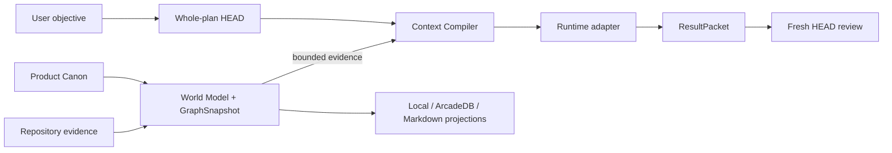

<div align="center">

# HEAD Agent Core Plugin

[English](README.md) | [한국어](README.ko.md) | [Documentation](docs/README.md) | [한국어 문서](docs/ko/README.md)

**Keep long-running AI development on one reviewed product direction<br>
even when the tool, agent, or conversation changes.**

Recover safely after compaction. Give each task only the context it needs.
Keep the reason behind every accepted change.

[](https://github.com/binary1215/head-agent-plugin/actions/workflows/go-worker-build-release.yml)


[Why use it](#why-use-it) ·
[Who it is for](#who-it-is-for) ·
[Install](#install) ·
[First project](#first-project) ·
[Core model](#core-model) ·
[Graph](#graph-and-records) ·
[Capabilities](#capability-status) ·
[Docs](#documentation)

</div>

## What HEAD Agent Core does

HEAD Agent Core keeps the direction and evidence of AI-assisted development with
the project instead of trapping them inside one model conversation. Across
Claude Code, Codex, and OpenCode, it connects:

- what the user has approved about the product;
- what the repository and tests currently show;
- what one task actually needs to know;
- what an agent changed, how it was checked, and what happens next.

It does not primarily make a model write better code. It helps many AI-assisted
changes accumulate into the same reviewed product direction without making a
model session, Git host, generated document, or GraphDB the hidden source of
truth.

## Why use it

The benefits become more valuable as a project outlives one conversation.

### Continue after compaction or session loss

Conversation compaction is lossy, and provider summaries can omit a constraint
or quietly change the next step. For recovery-sensitive work, HEAD checkpoints
the exact purpose, approved decisions, current position, and next expected
result. After compaction it verifies that the project direction did not drift
before continuing. A newer real user request always wins over an older prepared
continuation.

This restores the work direction, not a transcript or a model persona. See
[Compaction recovery](docs/compaction-recovery.md) and
[Session recovery](docs/session-recovery.md).

### Give each task bounded, reviewable context

More context is not always better. The user can state the task in ordinary
language; the provider-neutral HEAD performs semantic task analysis and authors
task-local EvidenceNeeds in the conversation. It can name exact repository
paths, Product entities, and current graph node anchors without asking the user
to write JSON, choose a graph ID, or manage a token tier. Status, preparation,
repository inspection, and preview are internal HEAD steps rather than a setup
wizard the user must operate. The Context Compiler then verifies what was
actually included under a fixed budget while
recording exclusions and stale coverage. Lexical overlap remains fallback
discovery/ranking only; Core no longer chooses a semantic graph anchor from the
first matching word, makes a current file ineligible, or declares sufficiency.

The resulting Context Capsule is content-derived and reproducible. The same
verified inputs, compiler version, task, and budget produce the same identity;
Canon or digest drift stops reuse. This reduces noise, makes delegation easier to
review, and avoids treating the whole repository as prompt context. See
[Context Compiler](docs/context-compiler.md).

### Review why a change happened

Git can show which bytes changed. HEAD also preserves the reviewed reasoning
around the change:

```text
whole plan
  -> execution scope + task context
  -> agent result + verification evidence
  -> Fresh HEAD review + explicit decision
  -> ChangeSet + next checkpoint
```

A result cannot approve itself, and the next non-trivial Run waits for review.
Later, a maintainer can inspect the intended outcome, allowed scope, evidence,
decision, affected revisions, and next direction without reconstructing them
from a transcript or commit message. See
[Execution Lineage](docs/execution-lineage.md) and
[ChangeSets](docs/change-sets.md).

### Connect product intent to code and tests

HEAD can propose evidence-linked relationships from reviewed Features and
Capabilities to Files, Symbols, and Tests. It can then derive reviewable change-
impact candidates from exact before/after revisions. Inference remains a
candidate until explicit review, so a heuristic match never silently becomes a
product decision. See [Feature mapping](docs/feature-mapping.md).

### Additional benefits

| Common AI-development problem | What HEAD provides |
| --- | --- |
| Agents and runtimes build different interpretations | Claude Code, Codex, OpenCode, HEAD, and bounded workers use the same project-scoped `.head/` identities. |
| Model inference quietly becomes a decision | Inferred concepts and impacts remain reviewable candidates until an explicit user decision accepts them. |
| A handoff loses the current position | Provider-independent checkpoints preserve the exact work direction for another session, tool, or teammate. |
| A graph or generated document becomes hidden authority | GraphSnapshot, GraphDB, Markdown, and continuity remain rebuildable views over verified records. |
| A large repository overwhelms the prompt | Source Scope and bounded compilation keep unrelated generated, vendored, or copied material out of normal task context. |
| Several agents blur responsibility | Bounded execution, result evidence, and independent review stay distinct while HEAD integrates them into one outcome. |
| Parallel workers are hard to scan at a glance | A provider-neutral launch wave shows requested, started, returned, waiting, succeeded, and failed workers without merging their authorizations or treating wave completion as approval. |
| Git and deployment history must be typed by hand | Provider-neutral observations turn current product refs and host-reported deployment results into immutable P3 evidence, while only an approved successful exact-commit/ref match becomes a non-authoritative ReleaseObservation. |

> A conventional coding agent optimizes the current task. HEAD Agent Core
> optimizes for many tasks to accumulate into the same reviewed product
> direction.

These benefits reinforce one another:

```text
reviewed direction + current repository evidence
  -> bounded Context Capsule + HEAD sufficiency judgment
  -> bounded execution and explicit review
  -> decision and change history
  -> exact checkpoint for handoff, session loss, or compaction
```

## Who it is for

HEAD Agent Core is for people who must keep an AI-assisted product coherent
across more than one prompt, task, agent, or runtime.

| You are... | HEAD helps you... |
| --- | --- |
| A solo developer building a product over many AI sessions | Continue from the approved direction without re-explaining the project from scratch. |
| A technical lead coordinating several agents or bounded workers | Separate planning, implementation, and review while integrating results into one whole outcome. |
| A maintainer working in a large or long-lived repository | Give each task only the current repository evidence and history it actually needs. |
| A team using Claude Code, Codex, OpenCode, or changing providers | Keep one provider-independent project state instead of separate truth in every conversation. |
| A team that needs auditability or reliable handoff | Retain the purpose, evidence, explicit decision, impact, and recovery state behind an accepted change. |
| A product team connecting intent to implementation | Follow reviewed Features through code, tests, revisions, ChangeSets, and review evidence. |

It may be unnecessary for a one-off script, a short experiment with no recovery
needs, or work where conversation history is sufficient. It is also a poor fit
when inferred model output should be accepted without review, or when GraphDB is
expected to become the unquestioned source of project meaning.

## Install

Choose one installation path. The Codex and Claude Code marketplace paths
install the conversation Skill, typed MCP server, and verified native bundle for
all supported hosts. Only the exact current-host binary can be selected at
runtime. The user-scoped path also provides the global `head-agent` command for
automation and recovery and obtains its native package from the matching GitHub
Release.

### Codex Git marketplace

```powershell
codex plugin marketplace add binary1215/head-agent-plugin --ref codex-marketplace
codex plugin add head-agent-core@head-agent-plugin
```

Restart Codex after installation, start a new task so the installed Skill and
MCP server are loaded, then ask:

```text
Initialize or resume the small HEAD Core for this project and report readiness.
```

The marketplace install does not initialize a project, contact GraphDB, choose
a model, or approve Product Canon. Those transitions still require the typed
Core boundary and, where consequential, explicit user review.

### Claude Code Git marketplace

```powershell
claude plugin marketplace add binary1215/head-agent-plugin@claude-marketplace
claude plugin install head-agent-core@head-agent-plugin
```

Restart Claude Code after installation so the installed Skill and `head_core`
MCP server are loaded, then ask:

```text
Initialize or resume the small HEAD Core for this project and report readiness.
```

Claude Code copies the plugin into its versioned cache. The generated Claude
distribution therefore projects its MCP entry through `${CLAUDE_PLUGIN_ROOT}`;
the source Core and `.head/` identities remain unchanged. Installation does not
authorize project mutation, Product Canon review, GraphDB access, or a model
choice.

### Claude Code and OpenCode project projections

When using the user-scoped installation below, initialize the project with
`--runtime claude,codex,opencode`. Marketplace-installed Claude Code users can
request the same initialization through the bundled Skill. HEAD creates
`CLAUDE.md` plus `.mcp.json` for Claude Code, `AGENTS.md` for Codex, and
`opencode.json` for OpenCode only when those project files are absent. Existing
files are preserved and generated manual-integration projections remain under
`.head/generated/`.

After initialization, start `claude` or `opencode` in the project. Claude Code
asks for project MCP approval before using the shared `head_core` server. The
runtime-native instruction/config files are projections; `.head/` remains the
only canonical HEAD state.

### User-scoped CLI

Requirements: a current Node.js LTS release and either Git or a downloaded
source archive. Git inside the target project, Go, GraphDB, and a provider
runtime are optional.

Windows PowerShell:

```powershell
git clone https://github.com/binary1215/head-agent-plugin.git
Set-Location .\head-agent-plugin
.\scripts\install.ps1 --native auto --project C:\path\to\project --runtime claude,codex,opencode

head-agent --version
head-agent doctor C:\path\to\project
```

macOS or Linux:

```bash
git clone https://github.com/binary1215/head-agent-plugin.git
cd head-agent-plugin
./scripts/install.sh --native auto --project /path/to/project --runtime claude,codex,opencode

head-agent --version
head-agent doctor /path/to/project
```

The installer stages a content-verified release in the current user's data
directory and writes launchers to `~/.local/bin`. It does not edit a shell
profile, a Codex cache, remote GraphDB, or an existing project before the
explicit `--project` initialization step.

## First project

The default path initializes only the provider-neutral HEAD constitution and its
fixed Project/Session recovery anchors:

```powershell
head-agent init C:\path\to\project --runtime claude,codex,opencode
```

It returns `core_ready` without indexing the repository or starting Product,
World Model, Graph, or document governance. The same bounded status is available
at any time:

```powershell
head-agent status C:\path\to\project
```

The human-readable default shows Core, optional Product governance, Context
readiness, the active package version, and one next action. Add `--json` for the
stable machine-readable projection. That projection separates
`readiness.core`, `readiness.product`, and `readiness.context`, names one
`nextAction`, and lists optional capabilities with their real prerequisites.
For example, Product appears as `available-not-activated`, while bounded workers
appear as `requires-active-run-authorization`. This is a non-persisted advisory
projection: reading it never activates Product, creates a Run, grants authority,
or repairs drift. `profile` remains a choice for one initialize/resume operation,
not a hidden project mode.

Top-level status is deliberately actionable: `core_ready`,
`product_evidence_required`, `product_review_required`, `product_ready`,
`product_refresh_required`, or `core_drifted`. The exact lower-level onboarding
state remains visible under `readiness.product.onboardingStatus`.

### Conversational Context preparation and preview

In conversation, describe the task once. The HEAD Skill calls
`head_context_prepare`, performs semantic repository inspection, authors any
task-required `EvidenceNeed[]`, and calls `head_context_preview` without asking
the user to operate those steps. Missing or stale optional World evidence does
not block direct work, and justified budget expansion is automatic.

The same Core operations remain available from the CLI for automation and
diagnosis:

```powershell
head-agent context-prepare C:\path\to\project --task "<task>"
```

This task-only, non-persisted P4 projection returns the current Project,
World Model, and GraphSnapshot binding plus bounded lexical discovery material
and exact node identities. The user does not write `EvidenceNeed[]`. HEAD uses
ordinary semantic reasoning and repository inspection to author the structured
proposal, then gives that proposal to the existing preview verifier. Core does
not select evidence kinds or anchors, and absence from the lexical candidate
view never means irrelevance.

If Product/World has not been activated, preparation returns `curated_only` and
keeps direct Core work as the primary path. It discloses that reproducible
repository, Product, and graph Capsule evidence is unavailable, while ordinary
repository inspection remains possible. The explicit Product-profile entrypoint
is offered only as an optional escalation after HEAD or the user determines that
the task needs that evidence; preparation never activates or indexes the
repository by itself.

Advanced automation may call the preview directly with HEAD-authored structured
input:

```powershell
head-agent context-preview C:\path\to\project `
  --task "Keep this exact task text across retries" `
  --budget 32768 `
  --evidence-needs .\evidence-needs.json
```

CLI output is concise and human-readable by default. Add `--json` to either
command for the complete Capsule, identities, exclusions, and coverage proof.

The preview still returns the deterministic Capsule content, and now adds a
small read-only `workflow` projection. It reports whether the World Model is
current, missing, or stale-excluded; whether HEAD has defined EvidenceNeeds;
mechanical inclusion coverage; the current fixed budget tier; and one next
action. The preview starts at the requested tier and automatically retries only
when matching evidence was excluded specifically by `context-budget`. Every
attempt in `workflow.budget.attempts` and summarizes the tiers in
`workflow.budget.attemptedTiers`. Each attempt binds its tier, Capsule ID, and
coverage-proof digest. Common final
states are:

- `evidence_needs_unassessed`: HEAD must choose task-required evidence kinds or
  explicitly decide that no mechanical requirements are needed;
- `world_evidence_unavailable` or `world_refresh_required`: World activation,
  indexing, or refresh remains a separate explicit operation;
- `evidence_gap_requires_head_action`: evidence is absent, so a larger budget is
  not used, or matching evidence still does not fit at the 512K hard maximum;
- `ready_for_head_semantic_assessment`: inclusion coverage is complete, but HEAD
  must still judge semantic sufficiency.

The preparation and preview guides never invent EvidenceNeeds, refresh the World, persist the preview
Capsule, grants execution authority, or converts `coverage-complete` into
approval. Automatic expansion is a bounded read-only retry across the fixed
32K, 64K, 128K, 256K, and 512K tiers—not a provider call, open-ended context
growth, or a sufficiency judgment. The exact task and EvidenceNeeds remain
unchanged across retries.

### Conversation-first path

The bundled `head-agent-onboarding` Skill is the preferred interactive entry.
It inspects the current state, asks only for material choices such as repository
scope or storage mode, semantically analyzes bounded current evidence, submits a
typed proposal for Core verification, presents the resulting evidence-linked
candidates, and uses explicit review before Product Canon changes. It selects
the `product` profile explicitly. The provider proposal remains P3 evidence.

### Optional Product profile CLI path

Initialize or resume the same project and HEAD Session identities:

```powershell
head-agent init C:\path\to\project --runtime claude,codex,opencode --profile product
head-agent onboarding-status C:\path\to\project
```

Without a structured user brief, first use intentionally returns
`awaiting-evidence`; Core does not invent product concepts from symbols. The
conversation Skill normally supplies the fresh semantic proposal. CLI users may
pass the same `semanticProposal` inside `--input`; after Core verifies the exact
SourceSnapshot, paths, lines, optional symbols, and Product Model references, an
immutable candidate-set ID is returned. Inspect it before review:

```powershell
$onboarding = head-agent onboarding-status C:\path\to\project | ConvertFrom-Json
head-agent onboarding-candidates C:\path\to\project `
  --candidate-set $onboarding.state.candidateSetId
```

Create `onboarding-review.json` only after reviewing the evidence. This compact
example accepts the complete bootstrap batch; selection or revision is safer
when any candidate should be renamed, split, merged, or excluded.

```json
{
  "candidateSetId": "onboarding-candidates-<id>",
  "disposition": "accept-all",
  "rationale": "I reviewed every evidence-linked candidate and adopt this bootstrap batch."
}
```

Apply the decision and verify the resulting views:

```powershell
head-agent onboarding-review C:\path\to\project --input .\onboarding-review.json
head-agent world-status C:\path\to\project
head-agent context-preview C:\path\to\project `
  --task "Find implementation evidence for one reviewed Feature" --budget 32768
head-agent world-docs-build C:\path\to\project
head-agent resume C:\path\to\project --runtime claude,codex,opencode --profile product
```

`accept-all` is supported for a fully inspected batch, but it is not the default
recommendation. Review can instead accept a dependency-complete selection,
revise or reject the batch, request more evidence, or retain explicit Unknowns.
See [Onboarding](docs/onboarding.md) for the complete contract.

### Source scope

For repositories with generated output, vendored dependencies, copied projects,
large fixtures, or model bundles, define a project-relative observation boundary
before the first index:

```json
{
  "mode": "existing",
  "sourceScope": {
    "includeRoots": ["src", "packages"],
    "excludeRoots": ["dist", "vendor", "generated", "fixtures"]
  }
}
```

Pass it with `head-agent init ... --profile product --input .\onboarding.json`. Source Scope
controls observation only; it cannot define Product Canon, approve a candidate,
or grant execution authority.

## Core model

HEAD separates meaning, recovery, evidence, views, and effects so that one
representation cannot inherit another's authority.

| Plane | Owns | Examples | Does not authorize |
| --- | --- | --- | --- |
| P1 Normative authority | approved meaning and explicit decisions | Product Canon, ReviewDecision | inference from a graph, result, or message |
| P2 Recovery and lineage | provider-independent project direction | Session, Run, plan, Capsule, contract, checkpoint | rewriting direction from a summary or result |
| P3 Evidence | reviewable observations and results | candidates, ResultPacket, ChangeSet, receipts | self-promotion or checkpoint authorship |
| P4 Derived views | reproducible retrieval and human views | GraphSnapshot, traversal, Markdown, continuity | Canon mutation or unique recovery |
| P5 Operational effects | host-local execution and delivery | PID, lease, endpoint, inbox, delivery receipt | execution, review, promotion, or recovery authority |

Distribution and host integrations package or execute these contracts; neither
becomes a sixth source of product meaning. The complete executable boundary is
documented in [Authority planes](docs/authority-plane-contract.md).

The smaller normative root and the formal Record/Graph boundary are documented
in [Provider-neutral HEAD constitution](docs/head-constitution.md).

### Architecture at a glance



The feedback path is explicit: an accepted result may become reviewed lineage,
the repository can be re-indexed, and a later graph may project that evidence.
No result, projection, or runtime effect accepts itself.

### Minimum sufficient context

The Context Compiler selects task-relevant evidence under an explicit budget.
It records what was included, excluded, stale, missing, truncated, or unknown.
The same canonical inputs, compiler version, traversal policy, and budget
reproduce the same Context Capsule.

Budgets use five deterministic approximate-token tiers: `32768` (default),
`65536`, `131072`, `262144`, and `524288` (hard maximum). Read-only preview
starts at 32K and advances automatically only while an unmet HEAD-owned need has
matching evidence excluded by `context-budget`. Direct compilation and Capsule
persistence still use one explicit tier, and 512K is never exceeded.
These are compiler estimates, currently calculated as UTF-16 code units divided
by four; the runtime adapter must still check the provider's actual tokenizer,
context window, and output reserve before invocation.

HEAD decides which evidence the current task actually requires. It can pass
task-local `EvidenceNeed[]` entries with exact repository `paths` for source or
test evidence, exact Product Canon `entityKeys` for Product Context, or specific
graph relations plus exact current `graphAnchor` node IDs and traversal bounds;
the Compiler does not invent a universal test rule or infer semantics from word
overlap. Stale, cross-project, hidden-candidate, tampered, or enlarged graph
anchors fail closed.
It emits a reproducible `coverageAssessment` proving only whether matching
evidence was included. The later ExecutionContract records HEAD's separate
semantic acceptance with the exact need-set and coverage-proof digests.

A Capsule is a derived execution input, not a second Canon. Digest or Canon drift
fails closed; simple read/reason work does not create a Capsule by default.

### Execution and recovery

Non-trivial execution follows a durable, reviewable sequence:

```text
WholePlanSnapshot
  → ExecutionContract + ContextCapsule
  → runtime or bounded worker
  → ResultPacket
  → Fresh HEAD ReviewDecision
  → accepted lineage or a revised plan
```

Provider loss does not require importing a transcript. `session-restore`
reconstructs the current input from the exact P2 checkpoint and verified lineage.
After an accepted result, `run-integrate-checkpoint` can bind that review to a new
checkpoint only when HEAD or the user explicitly supplies its recovery fields.

Intentional context compaction uses the same boundary:

1. `compact-prepare` freezes purpose, approved decisions, current position, and
   the next expected result;
2. provider compaction occurs outside Core;
3. `compact-verify` checks trusted real-user-turn evidence and rejects drift or
   summary-derived recovery;
4. `compact-continue` consumes one checkpoint-bound token.

A newer real user turn wins over a pending continuation. See
[Compaction recovery](docs/compaction-recovery.md) and
[Session recovery](docs/session-recovery.md).

### Product learning

Everyday observations can remain non-persisted notes. Durable artifacts are
created only when another Run, audit, product-state transition, or handoff needs
them:

```text
Signal → Hypothesis → Initiative candidate → user ReviewDecision
       → reviewed Initiative → accepted execution → OutcomeObservation
```

This is not one automatic promotion chain. Evidence remains evidence,
hypotheses remain hypotheses, and a reviewed Initiative remains distinct from
Product Canon. `head-agent operating-lane-recommend` can advise the lightest safe lane
without creating authority:

- Observe for read and reasoning work;
- Session for one bounded, reversible result;
- Run for dependent or recovery-sensitive work;
- Authority for Canon, initiative decisions, external writes, credentials, or
  recovery-canon changes.

See [Product Operating Loop](docs/product-operating-loop.md).
Git ref and deployment plumbing is documented in
[Release observation](docs/release-observation.md).

## Graph and records

A `GraphSnapshot` is the immutable, content-addressed evidence graph embedded in
one verified Repository World Model. It is not a graph UI screenshot, database
backup, or mutable latest-node collection. The same verified inputs produce the
same `graphSnapshotId`; semantic changes create a new snapshot with explicit
ancestry.

`head_world_model` verifies that complete model and current repository, then
returns a bounded status projection instead of transporting the full snapshot.
Counts, IDs, digests, samples, and omission metadata stay available; deeper
inspection uses the bounded graph, history, runtime, and semantic query tools.
This keeps MCP responses small without skipping any freshness or digest check.


Raw prompts stay outside this graph. Product meaning enters only through
reviewed Canon artifacts. Candidate nodes may be inspected explicitly, but are
excluded from default traversal and Context compilation.

Source relations are structural evidence, not product meaning. The default
heuristic import/call graph remains available, while an optional provider-neutral
language-AST adapter may add separately labeled, exact-file-bound evidence. One
source never silently overwrites the other, and neither can approve a decision.

### Graph versus record

The direction is deliberate:

```text
P1 Product Canon + observed source + verified P2/P3 records
  → P4 Repository World Model containing a recoverable GraphSnapshot
      → replaceable graph materialization: local JSON / optional ArcadeDB
      → replaceable human projection: Markdown
```

The graph owns navigation, not meaning or recovery direction. Deleting GraphDB
or generated Markdown must leave Product Canon, Session/Run recovery, and review
lineage intact. A stale, tampered, or semantically divergent projection fails
closed instead of redefining the graph.

### Query the graph

```powershell
head-agent world-status C:\path\to\project
head-agent world-temporal C:\path\to\project `
  --query "<Feature, symbol, path, ChangeSet, or ReviewDecision>" `
  --depth 3 --limit 100 --edge-limit 200
head-agent context-preview C:\path\to\project --task "<task>" --budget 32768
```

Traversal returns snapshot, query, and result identities plus inclusion,
exclusion, and truncation reasons. Embedded, local JSON, and activated ArcadeDB
backends must preserve the same semantic result.

## Runtime and coordination

Claude Code, Codex, and OpenCode are projections over one `.head/` authority. Runtime adapters
observe capability, consume one exact authorization at most once, supervise the
owned process tree, validate structured output, and keep operational state
outside the project.

Role coordination is intentionally small: send, read-inbox, bounded wait-reply,
and immutable reply. A trusted host binds each endpoint to one project role;
callers cannot assert their own sender role. Messages and delivery receipts are
evidence only and cannot create a ReviewDecision, widen a contract, mutate
Product Canon, or rewrite recovery direction.

Host-specific pane, socket, CLI, and UI behavior belongs in separately owned
optional adapters. The Core keeps provider-neutral endpoint, project-root,
fresh-snapshot, proof, acknowledgment, and cleanup fences. General provider
resume and streaming remain deferred. See [Runtime adapters](docs/runtime-adapters.md)
and [Role coordination](docs/role-coordination.md).

## Optional GraphDB

Local storage is the safe default. GraphDB is not required for onboarding,
context compilation, execution lineage, or recovery.

ArcadeDB can be explicitly activated as a derived graph projection. Credentials
are resolved only through environment-variable references and never enter
project artifacts, graph identities, generated documents, or receipts. Remote
activation must prove semantic conformance with the recoverable embedded graph.

The JavaScript bridge is the semantic reference. When a verified native package
is present, read-only prepared queries may use a content-addressed Go query-batch
bridge; JavaScript still verifies the pointer, topology, traversal, request
binding, and receipt. Set `HEAD_AGENT_ARCADEDB_NATIVE_MODE` to:

- `auto` — use the verified native bridge when available, otherwise disclose and
  use the JavaScript reference path;
- `off` — always use the JavaScript path;
- `required` — fail when the verified native path is unavailable.

Manifest, binary, and post-selection digest mismatches always fail closed.
Exact children receive only configured credential-reference variables and a
bounded OS, TLS, locale, and proxy allowlist. The compute worker itself remains
network-free and authority-free. See
[Graph projection adapter](docs/graph-projection-adapter.md).

## Installation lifecycle

### Native packages

User-scoped install and upgrade default to `--native auto`. The installer selects
the exact version and platform package, verifies release checksum, archive paths,
build metadata, and native manifests, then includes the binaries in the release
identity. Use `--native off` for JavaScript-only installation or
`--native required` when fallback is unacceptable.

Codex and Claude marketplace snapshots carry the same verified packages for all
five supported targets, so those installs do not need a runtime download. A
missing target, mixed build commit, or manifest/digest mismatch blocks
marketplace publication.

Native components have separate contracts for authority-free computation, owned
process supervision, and read-only ArcadeDB batching. Installing one never
changes Product Canon, graph identity, review authority, or lineage.

### Status, upgrade, rollback, and removal

Run lifecycle commands from the newly downloaded source tree:

```powershell
node .\scripts\distribution.mjs upgrade
node .\scripts\distribution.mjs status
node .\scripts\distribution.mjs rollback
node .\scripts\distribution.mjs uninstall
```

Upgrade stages and verifies an immutable release before replacing the active
pointer. Normal removal deletes launchers and the active pointer but preserves
verified releases for recovery. `uninstall --purge` also removes the user-scoped
release store. Neither form traverses or deletes project `.head` state, Git data,
generated project documents, or GraphDB data.

Provider configuration and authentication remain owned by Claude Code, Codex,
or OpenCode. HEAD passes only the exact authorized `provider/model` plus an
ephemeral permission/privacy overlay; it does not install provider presets,
copy credentials, or rewrite endpoints.

## Capability status

Status labels are evidence claims, not roadmap promises:

- **Available** — implemented in the current source distribution;
- **Experimental** — implemented behind an explicit or limited activation path;
- **Planned** — accepted direction but not shipped;
- **Deferred** — intentionally outside the current milestone.

| Area | Capability | Status |
| --- | --- | --- |
| Project | initialization, Source Scope, review-gated Product Canon | **Available** |
| Knowledge | World Model, incremental refresh, Context Capsules | **Available** |
| Lineage | Runs, ResultPackets, Fresh HEAD review, Session restore, compaction | **Available** |
| Runtime | Claude Code, Codex, and OpenCode one-shot Session/Run execution | **Available** |
| Runtime evidence | deterministic three-runtime fixtures and local CLI capability probes | **Available** |
| Runtime evidence | Claude Code live model-call conformance | **Experimental** |
| Release evidence | provider-neutral Git ref, deployment-result, and release observations | **Available** |
| Workers | bounded dispatch, wait, result, review, integration | **Available** |
| Coordination | durable role messaging and exact-endpoint host delivery | **Available** |
| Projection | local graph and Markdown | **Available** |
| Projection | ArcadeDB | **Experimental** |
| Distribution | user-scoped install, native delivery, rollback, safe removal | **Available** |
| Distribution | verified Git-backed Codex marketplace | **Available** |
| Distribution | verified Git-backed Claude Code marketplace | **Available** |
| Distribution | OpenAI universal plugin directory | **Planned** |
| Runtime | general provider-session resume and streaming | **Deferred** |
| Documents | Obsidian and Notion adapters | **Deferred** |

For exact claims and acceptance evidence, use the subsystem documents and source
verification rather than inferring capability from this summary.

## Design principles

HEAD Agent Core Plugin is inspired by
[Won6314/head-agent-core](https://github.com/Won6314/head-agent-core) and
independently reworked as a provider-neutral plugin. It is not an official
upstream release or a drop-in replacement. See the
[source-grounded comparison](docs/original-head-core-comparison.md).

This implementation retains the foundational HEAD principles while expressing
them through provider-neutral contracts:

- HEAD owns the connected whole outcome;
- the user retains consequential authority;
- semantic sufficiency belongs to HEAD; bounded verified context beats maximum context;
- durable Canon survives temporary model sessions;
- delegation stays bounded and non-authoritative;
- completion requires connected primary evidence;
- graphs are retrieval indexes, not unquestioned authority;
- project meaning remains separate from runtime mechanisms.

Read the upstream
[Foundations](https://github.com/Won6314/head-agent-core/blob/main/packages/core/docs/FOUNDATIONS.md)
and
[Technical Architecture](https://github.com/Won6314/head-agent-core/blob/main/packages/core/docs/TECHNICAL_ARCHITECTURE.md)
for the original design context.

## Documentation

Browse the [complete English documentation index](docs/README.md) or the
[complete Korean documentation index](docs/ko/README.md). Every public English
subsystem document has a Korean counterpart; code, command names, protocol
identifiers, and artifact field names remain unchanged across languages.

Start with these documents:

- [Architecture](docs/architecture.md) — the provider-neutral composition;
- [Authority planes](docs/authority-plane-contract.md) — the executable
  Graph/record and non-amplification contract;
- [Onboarding](docs/onboarding.md) — HEAD semantic proposals, Core verification, and explicit review;
- [Context Compiler](docs/context-compiler.md) — reproducible task context;
- [Execution Lineage](docs/execution-lineage.md) — plans, contracts, results,
  review, and recovery;
- [World Model](docs/world-model.md) — source evidence and graph construction;
- [Runtime adapters](docs/runtime-adapters.md) — capability, invocation, and
  process ownership;
- [Performance fast path](docs/performance-fast-path-design.md) — optimization
  without semantic or authority shortcuts.

Additional references:

- [Product Model](docs/product-model.md)
- [Product Operating Loop](docs/product-operating-loop.md)
- [Release observation](docs/release-observation.md)
- [Incremental refresh](docs/incremental-refresh.md)
- [Compaction recovery](docs/compaction-recovery.md)
- [Session recovery](docs/session-recovery.md)
- [Role coordination](docs/role-coordination.md)
- [Graph projection adapter](docs/graph-projection-adapter.md)
- [Document projection adapter](docs/document-projection-adapter.md)
- [Codex marketplace distribution](docs/codex-marketplace.md)
- [Claude Code marketplace distribution](docs/claude-marketplace.md)

Installed behavior is governed by these runtime contracts, the target project's
user-owned Canon, current Session/Run recovery state, and explicit
ReviewDecisions. Repository-development history, benchmark fixtures, and
maintainer milestones are evidence about the plugin; they are not instructions
for a project using it.

## Verify from source

```powershell
npm test
npm run verify:newcomer
npm run verify:distribution
npm run verify:codex-marketplace
npm run verify:claude-marketplace
```

Native sources additionally support `go test ./...` and `go vet ./...` from the
corresponding module directories. JavaScript remains the semantic reference;
native backends are advertised only after fixture-driven conformance and
integrity verification.

## Status and licensing

HEAD Agent Core Plugin is beta software: the provider-neutral constitutional
Core, recovery, Context Compiler, execution lineage, local projections, bounded
workers, and verified Codex/Claude distribution are ready for broader testing.
Capabilities marked Experimental, Planned, or Deferred above remain outside
that beta claim.

This project is released under the [MIT License](LICENSE).
